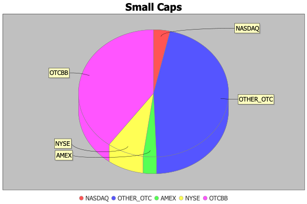
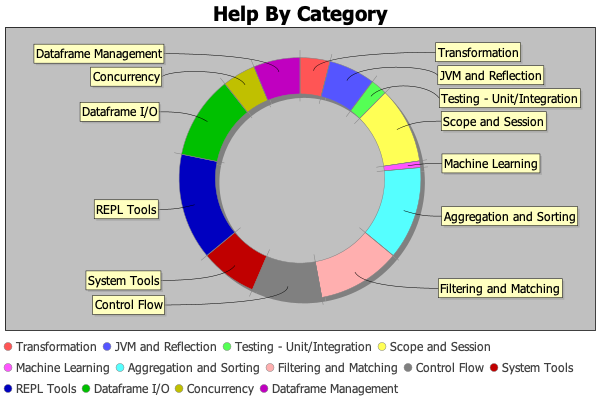

Lollypop v0.1.5.6
============

## Table of Contents
* <a href="#Introduction">Introduction</a>
* <a href="#Project_Status">Project Status</a>
* <a href="#Getting_Started">Getting Started</a>
* <a href="#Basic_Examples">Basic Features</a>
  * <a href="#Array_Comprehensions">Array Comprehensions</a>
  * <a href="#Array_Literals">Array Literals</a>
  * <a href="#Dataframe_Literals">Dataframe Literals</a>
  * <a href="#Define_and_Instantiate_JVM_classes">Define and Instantiate JVM classes</a>
  * <a href="#Dictionary_Object_Literals">Dictionary/Object Literals</a>
  * <a href="#Implicit_Class_Declarations">Implicit Class Declarations</a>
  * <a href="#Implicit_Class_Importing">Implicit Class Importing</a>
  * <a href="#Matrix_and_Vector_Literals">Matrix and Vector Literals</a>
  * <a href="#String_Literals_Double_quoted_">String Literals (Double-quoted)</a>
  * <a href="#String_Literals_Single_quoted_">String Literals (Single-quoted)</a>
  * <a href="#String_Literals_Triple_Double_quoted_">String Literals (Triple-Double-quoted)</a>
  * <a href="#String_Literals_Triple_Single_quoted_">String Literals (Triple-Single-quoted)</a>
* <a href="#Examples">Featured Examples By Category</a>
  * <a href="#Aggregation_Sorting">Aggregation/Sorting</a> (23)
  * <a href="#Asynchronous_Distributed_Reactive">Asynchronous/Distributed/Reactive</a> (16)
  * <a href="#Control_Flow">Control Flow</a> (21)
  * <a href="#Dataframe_I_O">Dataframe I/O</a> (23)
  * <a href="#Dataframe_Management">Dataframe Management</a> (14)
  * <a href="#Filtering_Pattern_Matching">Filtering/Pattern Matching</a> (25)
  * <a href="#JVM_and_Reflection">JVM and Reflection</a> (14)
  * <a href="#Scope_Session">Scope/Session</a> (23)
  * <a href="#System_Tools">System Tools</a> (12)
  * <a href="#Testing__Unit_Integration">Testing - Unit/Integration</a> (5)
  * <a href="#Transformation">Transformation</a> (9)
<a name="Introduction"></a>
## Introduction
Lollypop is a general-purpose programming/scripting language for the JVM.
Features include:
* Native support for Scala and Java classes, objects and packages.
* Native support for JSON (arrays, dictionaries and objects).
* Native support for Maven package repositories.
* Data-oriented types - Dataframes, BLOB/CLOB and Matrices and Vectors.
* Multi-paradigm programming model - declarative/SQL, functional, object-oriented and reactive.

<a name="Project_Status"></a>
## Project Status

Unstable/Preview &#8212; it works... but the language parser is a little temperamental.

<a name="Getting_Started"></a>
## Getting Started
### To build Lollypop Core (Client and Server)
```bash
sbt "project core" clean assembly
```
The Jar binary should be `./app/core/target/scala-2.13/core-assembly-0.1.5.6.jar`

### To build the Lollypop JDBC driver
```bash
sbt "project jdbc_driver" clean assembly
```
The Jar binary should be `./app/jdbc-driver/target/scala-2.13/jdbc-driver-assembly-0.1.5.6.jar`

### Run Lollypop CLI
```bash
sbt "project core" run
```
OR
```bash
java -jar ./app/core/target/scala-2.13/core-assembly-0.1.5.6.jar
```

<a name="Basic_Examples"></a>
## Basic Features

<a name="Array_Comprehensions"></a>
### Array Comprehensions
*Description*: Define logical arrays

```sql
['A' to 'F'].reverse()
```
##### Results
```sql
['F', 'E', 'D', 'C', 'B', 'A']
```
<a name="Array_Literals"></a>
### Array Literals
*Description*: Define arrays and apply monadic functions

```sql
[1, 3, 5, 7].foldLeft(0, (a, b) => a + b)
```
##### Results
```sql
16
```
<a name="Dataframe_Literals"></a>
### Dataframe Literals
*Description*: Produces graphical charts

```sql
graph { shape: "ring", title: "Ring Demo" } from (
  |------------------|
  | exchange | total |
  |------------------|
  | NASDAQ   |    24 |
  | AMEX     |     5 |
  | NYSE     |    28 |
  | OTCBB    |    32 |
  | OTHEROTC |     7 |
  |------------------|
)
```
##### Results
<div style="width: 100%">

</div>

<a name="Define_and_Instantiate_JVM_classes"></a>
### Define and Instantiate JVM classes
*Description*: Creates a new ephemeral (in-memory) JVM-compatible class

```sql
class StockQuote(symbol: String, exchange: String, lastSale: Double, lastSaleTime: Date)
stock = new StockQuote("ABC", "OTCBB", 0.0231, DateTime())
stock.toString()
```
##### Results
```sql
StockQuote("ABC", "OTCBB", 0.0231, "2023-11-02T21:25:17.281Z")
```
<a name="Dictionary_Object_Literals"></a>
### Dictionary/Object Literals
*Description*: Dynamically create objects (e.g. JSON)

```sql
response = { 'message1' : 'Hello World' }
response.message2 = 'Hallo Monde'
response.message3 = ['Hello', 'Hallo', 'World', 'Monde']
response
```
##### Results
```sql
{"message1": "Hello World", "message2": "Hallo Monde", "message3": ["Hello", "Hallo", "World", "Monde"]}
```
<a name="Implicit_Class_Declarations"></a>
### Implicit Class Declarations
*Description*: Binds a virtual method to a class

```sql
implicit class `java.lang.String` {
    def reverseString(self) := {
        import "java.lang.StringBuilder"
        val src = self.toCharArray()
        val dest = new StringBuilder(self.length())
        val eol = self.length() - 1
        var n = 0
        while (n <= eol) {
          dest.append(src[eol - n])
          n += 1
        }
        dest.toString()
    }
}

"Hello World".reverseString()
```
##### Results
```sql
dlroW olleH
```
<a name="Implicit_Class_Importing"></a>
### Implicit Class Importing
*Description*: Imports the methods of a Scala implicit class

```sql
import implicit "com.lollypop.util.StringRenderHelper$StringRenderer"
DateTime().renderAsJson()
```
##### Results
```sql
"2023-11-02T21:25:17.364Z"
```
<a name="Matrix_and_Vector_Literals"></a>
### Matrix and Vector Literals
*Description*: Creates a new matrix

```sql
vector = [2.0, 1.0, 3.0]
matrixA = new Matrix([
  [1.0, 2.0, 3.0],
  [4.0, 5.0, 6.0],
  [7.0, 8.0, 9.0]
])
matrixA * vector
```
##### Results
```sql
[13.0, 31.0, 49.0]
```
<a name="String_Literals_Double_quoted_"></a>
### String Literals (Double-quoted)
*Description*: Declare strings

```sql
item = { name : "Larry" }
"Hello {{ item.name }},\nhow are you?\nFine, I hope!"
```
##### Results
```sql
Hello Larry,
how are you?
Fine, I hope!
```
<a name="String_Literals_Single_quoted_"></a>
### String Literals (Single-quoted)
*Description*: Declare strings

```sql
item = { name : "Larry" }
'Hello {{ item.name }},\nhow are you?\nFine, I hope!'
```
##### Results
```sql
Hello Larry,
how are you?
Fine, I hope!
```
<a name="String_Literals_Triple_Double_quoted_"></a>
### String Literals (Triple-Double-quoted)
*Description*: Declare multiline strings

```sql
item = { name : "Larry" }
"""|Hello {{ item.name }},
   |how are you?
   |Fine, I hope!
   |""".stripMargin('|')
```
##### Results
```sql
Hello Larry,
how are you?
Fine, I hope!

```
<a name="String_Literals_Triple_Single_quoted_"></a>
### String Literals (Triple-Single-quoted)
*Description*: Declare multiline strings

```sql
item = { name : "Larry" }
'''|Hello {{ item.name }},
   |how are you?
   |Fine, I hope!
   |'''.stripMargin('|')
```
##### Results
```sql
Hello Larry,
how are you?
Fine, I hope!

```
<a name="Examples"></a>

<a name="Aggregation_Sorting"></a>
## Aggregation/Sorting Examples
<hr>

### avg¹ (Aggregation/Sorting &#8212; Functional)
*Description*: Computes the average of a numeric expression.

```sql
val stocks =
    |------------------------------|
    | symbol | exchange | lastSale |
    |------------------------------|
    | XYZ    | AMEX     |    31.95 |
    | ABC    | NYSE     |    56.12 |
    | DNS    | AMEX     |    97.61 |
    |------------------------------|
avg(stocks#lastSale)
```
##### Results
```sql
61.89333333333334
```
### avg² (Aggregation/Sorting &#8212; Functional)
*Description*: Computes the average of a numeric expression.

```sql
val stocks =
    |------------------------------|
    | symbol | exchange | lastSale |
    |------------------------------|
    | XYZ    | AMEX     |    31.95 |
    | ABC    | NYSE     |    56.12 |
    | DNS    | AMEX     |    97.61 |
    |------------------------------|
select avgLastSale: avg(lastSale) from @@stocks
```
##### Results
```sql
|-------------------|
| avgLastSale       |
|-------------------|
| 61.89333333333334 |
|-------------------|
```
### count¹ (Aggregation/Sorting &#8212; Functional)
*Description*: Returns the number of rows matching the query criteria.

```sql
stocks =
|---------------------------------------------------------|
| exchange | symbol | lastSale | lastSaleTime             |
|---------------------------------------------------------|
| NYSE     | RPPI   |  51.8413 | 2023-09-28T00:58:42.974Z |
| AMEX     | MDLA   | 177.1311 | 2023-09-28T00:58:44.363Z |
| OTCBB    | VMUT   |          | 2023-09-28T00:58:35.392Z |
| AMEX     | QTZUA  | 120.5353 | 2023-09-28T00:58:08.024Z |
| OTCBB    | JCJMT  |          | 2023-09-28T00:58:17.985Z |
| NASDAQ   | EMY    |  24.6447 | 2023-09-28T00:58:22.595Z |
|---------------------------------------------------------|
count(stocks)
```
##### Results
```sql
6
```
### count² (Aggregation/Sorting &#8212; Functional)
*Description*: Returns the number of rows matching the query criteria.

```sql
stocks =
|---------------------------------------------------------|
| exchange | symbol | lastSale | lastSaleTime             |
|---------------------------------------------------------|
| NYSE     | RPPI   |  51.8413 | 2023-09-28T00:58:42.974Z |
| AMEX     | MDLA   | 177.1311 | 2023-09-28T00:58:44.363Z |
| OTCBB    | VMUT   |          | 2023-09-28T00:58:35.392Z |
| AMEX     | QTZUA  | 120.5353 | 2023-09-28T00:58:08.024Z |
| OTCBB    | JCJMT  |          | 2023-09-28T00:58:17.985Z |
| NASDAQ   | EMY    |  24.6447 | 2023-09-28T00:58:22.595Z |
|---------------------------------------------------------|
count(stocks#lastSale)
```
##### Results
```sql
6
```
### count³ (Aggregation/Sorting &#8212; Functional)
*Description*: Returns the number of rows matching the query criteria.

```sql
stocks =
|---------------------------------------------------------|
| exchange | symbol | lastSale | lastSaleTime             |
|---------------------------------------------------------|
| NYSE     | RPPI   |  51.8413 | 2023-09-28T00:58:42.974Z |
| AMEX     | MDLA   | 177.1311 | 2023-09-28T00:58:44.363Z |
| OTCBB    | VMUT   |          | 2023-09-28T00:58:35.392Z |
| AMEX     | QTZUA  | 120.5353 | 2023-09-28T00:58:08.024Z |
| OTCBB    | JCJMT  |          | 2023-09-28T00:58:17.985Z |
| NASDAQ   | EMY    |  24.6447 | 2023-09-28T00:58:22.595Z |
|---------------------------------------------------------|
select total: count(*) from @@stocks
```
##### Results
```sql
|-------|
| total |
|-------|
|     6 |
|-------|
```
### count (Aggregation/Sorting &#8212; Functional)
*Description*: Returns the number of rows matching the query criteria.

```sql
stocks =
|---------------------------------------------------------|
| exchange | symbol | lastSale | lastSaleTime             |
|---------------------------------------------------------|
| NYSE     | RPPI   |  51.8413 | 2023-09-28T00:58:42.974Z |
| AMEX     | MDLA   | 177.1311 | 2023-09-28T00:58:44.363Z |
| OTCBB    | VMUT   |          | 2023-09-28T00:58:35.392Z |
| AMEX     | QTZUA  | 120.5353 | 2023-09-28T00:58:08.024Z |
| OTCBB    | JCJMT  |          | 2023-09-28T00:58:17.985Z |
| NASDAQ   | EMY    |  24.6447 | 2023-09-28T00:58:22.595Z |
|---------------------------------------------------------|
select total: count(lastSale) from @@stocks
```
##### Results
```sql
|-------|
| total |
|-------|
|     4 |
|-------|
```
### countUnique¹ (Aggregation/Sorting &#8212; Functional)
*Description*: Returns the distinct number of rows matching the query criteria.

```sql
stocks =
|---------------------------------------------------------|
| symbol | exchange | lastSale | lastSaleTime             |
|---------------------------------------------------------|
| VDON   | OTCBB    |   0.4002 | 2023-07-29T05:06:56.232Z |
| XETQ   | OTCBB    |   5.1147 | 2023-07-29T05:06:56.233Z |
| XGDJ   | NASDAQ   |  51.5446 | 2023-07-29T05:06:56.236Z |
| FQPY   | NASDAQ   |  75.4873 | 2023-07-29T05:06:56.238Z |
| VNQR   | NASDAQ   |  38.5333 | 2023-07-29T05:06:56.239Z |
|---------------------------------------------------------|
select total: count(unique(exchange)) from @@stocks
```
##### Results
```sql
|-------|
| total |
|-------|
|     2 |
|-------|
```
### countUnique² (Aggregation/Sorting &#8212; Functional)
*Description*: Returns the distinct number of rows matching the query criteria.

```sql
stocks =
|---------------------------------------------------------|
| symbol | exchange | lastSale | lastSaleTime             |
|---------------------------------------------------------|
| VDON   | OTCBB    |   0.4002 | 2023-07-29T05:06:56.232Z |
| XETQ   | OTCBB    |   5.1147 | 2023-07-29T05:06:56.233Z |
| XGDJ   | NASDAQ   |  51.5446 | 2023-07-29T05:06:56.236Z |
| FQPY   | NASDAQ   |  75.4873 | 2023-07-29T05:06:56.238Z |
| VNQR   | NASDAQ   |  38.5333 | 2023-07-29T05:06:56.239Z |
|---------------------------------------------------------|
select total: countUnique(exchange) from @@stocks
```
##### Results
```sql
|-------|
| total |
|-------|
|     2 |
|-------|
```
### group by¹ (Aggregation/Sorting &#8212; Declarative)
*Description*: Aggregates a result set by a column

```sql
select kind, total: count(*)
from (this.toTable())
group by kind
```
##### Results
```sql
|------------------------|
| kind           | total |
|------------------------|
| PrintStream    |     2 |
| Random$        |     1 |
| OS             |     1 |
| BufferedReader |     1 |
| Double         |     1 |
|------------------------|
```
### group by² (Aggregation/Sorting &#8212; Declarative)
*Description*: Aggregates a result set by a column

```sql
chart = { shape: "bar", title: "Types in Session" }
graph chart from (
    select kind, total: count(*)
    from (this.toTable())
    group by kind
)
```
##### Results
<div style="width: 100%">

</div>

### max¹ (Aggregation/Sorting &#8212; Functional)
*Description*: Returns the maximum value of a numeric expression.

```sql
val stocks =
    |------------------------------|
    | symbol | exchange | lastSale |
    |------------------------------|
    | XYZ    | AMEX     |    31.95 |
    | ABC    | NYSE     |    56.12 |
    | DNS    | AMEX     |    97.61 |
    |------------------------------|
max(stocks#lastSale)
```
##### Results
```sql
97.61
```
### max² (Aggregation/Sorting &#8212; Functional)
*Description*: Returns the maximum value of a numeric expression.

```sql
val stocks =
    |------------------------------|
    | symbol | exchange | lastSale |
    |------------------------------|
    | XYZ    | AMEX     |    31.95 |
    | ABC    | NYSE     |    56.12 |
    | DNS    | AMEX     |    97.61 |
    |------------------------------|
select maxLastSale: max(lastSale) from @@stocks
```
##### Results
```sql
|-------------|
| maxLastSale |
|-------------|
|       97.61 |
|-------------|
```
### min¹ (Aggregation/Sorting &#8212; Functional)
*Description*: Returns the minimum value of a numeric expression.

```sql
val stocks =
    |------------------------------|
    | symbol | exchange | lastSale |
    |------------------------------|
    | XYZ    | AMEX     |    31.95 |
    | ABC    | NYSE     |    56.12 |
    | DNS    | AMEX     |    97.61 |
    |------------------------------|
min(stocks#lastSale)
```
##### Results
```sql
31.95
```
### min² (Aggregation/Sorting &#8212; Functional)
*Description*: Returns the minimum value of a numeric expression.

```sql
val stocks =
    |------------------------------|
    | symbol | exchange | lastSale |
    |------------------------------|
    | XYZ    | AMEX     |    31.95 |
    | ABC    | NYSE     |    56.12 |
    | DNS    | AMEX     |    97.61 |
    |------------------------------|
select minLastSale: min(lastSale) from @@stocks
```
##### Results
```sql
|-------------|
| minLastSale |
|-------------|
|       31.95 |
|-------------|
```
### order by (Aggregation/Sorting &#8212; Declarative)
*Description*: Sorts a result set by a column

```sql
from (
 |---------------------------------------------------------|
 | symbol | exchange | lastSale | lastSaleTime             |
 |---------------------------------------------------------|
 | HWWM   | NASDAQ   | 191.6725 | 2023-08-06T18:33:08.661Z |
 | VLYW   | AMEX     | 197.9962 | 2023-08-06T18:33:08.670Z |
 | VSOM   | NASDAQ   | 166.8542 | 2023-08-06T18:33:08.672Z |
 | FHWS   | NYSE     |  22.5909 | 2023-08-06T18:33:08.673Z |
 | SRGN   | AMEX     | 180.2358 | 2023-08-06T18:33:08.675Z |
 | PTFY   | NYSE     |  19.9265 | 2023-08-06T18:33:08.676Z |
 |---------------------------------------------------------|
) order by lastSale desc
```
##### Results
```sql
|---------------------------------------------------------|
| symbol | exchange | lastSale | lastSaleTime             |
|---------------------------------------------------------|
| VLYW   | AMEX     | 197.9962 | 2023-08-06T18:33:08.670Z |
| HWWM   | NASDAQ   | 191.6725 | 2023-08-06T18:33:08.661Z |
| SRGN   | AMEX     | 180.2358 | 2023-08-06T18:33:08.675Z |
| VSOM   | NASDAQ   | 166.8542 | 2023-08-06T18:33:08.672Z |
| FHWS   | NYSE     |  22.5909 | 2023-08-06T18:33:08.673Z |
| PTFY   | NYSE     |  19.9265 | 2023-08-06T18:33:08.676Z |
|---------------------------------------------------------|
```
### sum¹ (Aggregation/Sorting &#8212; Functional)
*Description*: Returns the sum of a numeric expression.

```sql
stocks = (
|-------------------|
| symbol | lastSale |
|-------------------|
| VHLH   | 153.2553 |
| GPI    |  89.7307 |
| SGE    | 131.6038 |
| GVABB  |  31.1324 |
| GTIT   | 110.6881 |
| JDXEZ  | 243.4389 |
| RNUBE  | 157.2571 |
| DBY    | 237.5894 |
| CO     | 109.6587 |
| BIU    | 232.9175 |
|-------------------|
)
sum(stocks#lastSale)
```
##### Results
```sql
1497.2719
```
### sum² (Aggregation/Sorting &#8212; Functional)
*Description*: Returns the sum of a numeric expression.

```sql
select total: sum(lastSale) from (
|-------------------|
| symbol | lastSale |
|-------------------|
| VHLH   | 153.2553 |
| GPI    |  89.7307 |
| SGE    | 131.6038 |
| GVABB  |  31.1324 |
| GTIT   | 110.6881 |
| JDXEZ  | 243.4389 |
| RNUBE  | 157.2571 |
| DBY    | 237.5894 |
| CO     | 109.6587 |
| BIU    | 232.9175 |
|-------------------|
)
```
##### Results
```sql
|-----------|
| total     |
|-----------|
| 1497.2719 |
|-----------|
```
### transpose¹ (Aggregation/Sorting &#8212; Declarative)
*Description*: Makes columns into rows and rows into columns. The function returns a table with the rows and columns transposed.

```sql
transpose(items: [1 to 5])
```
##### Results
```sql
|-------|
| items |
|-------|
|     1 |
|     2 |
|     3 |
|     4 |
|     5 |
|-------|
```
### transpose² (Aggregation/Sorting &#8212; Declarative)
*Description*: Makes columns into rows and rows into columns. The function returns a table with the rows and columns transposed.

```sql
faces = transpose(face: ["2", "3", "4", "5", "6", "7", "8", "9", "10", "J", "Q", "K", "A"])
suits = transpose(suit: ["♠", "♦", "♥", "♣"])
deck = faces * suits
deck.shuffle()
@@deck limit 5
```
##### Results
```sql
|-------------|
| face | suit |
|-------------|
| A    | ♥    |
| 7    | ♣    |
| J    | ♣    |
| 9    | ♥    |
| 2    | ♥    |
|-------------|
```
### transpose³ (Aggregation/Sorting &#8212; Declarative)
*Description*: Makes columns into rows and rows into columns. The function returns a table with the rows and columns transposed.

```sql
transpose(help('select'))
```
##### Results
```sql
|----------------------------------------------------------------------------------------------------|
| name        | value                                                                                |
|----------------------------------------------------------------------------------------------------|
| name        | select                                                                               |
| category    | Dataframe I/O                                                                        |
| paradigm    | Declarative                                                                          |
| description | Returns row(s) of data based on the expression and options                           |
| example     | select symbol: 'GMTQ', exchange: 'OTCBB', lastSale: 0.1111, lastSaleTime: DateTime() |
|----------------------------------------------------------------------------------------------------|
```
### transpose (Aggregation/Sorting &#8212; Declarative)
*Description*: Makes columns into rows and rows into columns. The function returns a table with the rows and columns transposed.

```sql
transpose(new Matrix([
  [1.0, 2.0, 3.0],
  [4.0, 5.0, 6.0],
  [7.0, 8.0, 9.0]
]))
```
##### Results
```sql
|-----------------|
| A   | B   | C   |
|-----------------|
| 1.0 | 4.0 | 7.0 |
| 2.0 | 5.0 | 8.0 |
| 3.0 | 6.0 | 9.0 |
|-----------------|
```
### unique (Aggregation/Sorting &#8212; Functional)
*Description*: Returns a unique collection of elements based on the query criteria.

```sql
val stocks =
  |------------------------------|
  | symbol | exchange | lastSale |
  |------------------------------|
  | XYZ    | AMEX     |    31.95 |
  | ABC    | NYSE     |    56.12 |
  | YOKE   | NYSE     |    56.12 |
  | DNS    | AMEX     |    97.61 |
  |------------------------------|
select exchange: unique(exchange) from @@stocks
```
##### Results
```sql
|------------------|
| exchange         |
|------------------|
| ["AMEX", "NYSE"] |
|------------------|
```
### unnest (Aggregation/Sorting &#8212; Declarative)
*Description*: Separates the elements of a collection expression into multiple rows, or the elements of map expr into multiple rows and columns.

```sql
declare table stocks(symbol: String(4), exchange: String(6), transactions: Table(price: Double, transactionTime: DateTime)[5])
insert into @@stocks (symbol, exchange, transactions)
values ('AAPL', 'NASDAQ', {price:156.39, transactionTime:"2021-08-05T19:23:11.000Z"}),
       ('AMD',  'NASDAQ', {price:56.87, transactionTime:"2021-08-05T19:23:11.000Z"}),
       ('INTC', 'NYSE',   {price:89.44, transactionTime:"2021-08-05T19:23:11.000Z"}),
       ('AMZN', 'NASDAQ', {price:988.12, transactionTime:"2021-08-05T19:23:11.000Z"}),
       ('SHMN', 'OTCBB', [{price:0.0010, transactionTime:"2021-08-05T19:23:11.000Z"},
                          {price:0.0011, transactionTime:"2021-08-05T19:23:12.000Z"}])

select symbol, exchange, unnest(transactions) from @@stocks where symbol is 'SHMN'
```
##### Results
```sql
|-------------------------------------------------------|
| symbol | exchange | price  | transactionTime          |
|-------------------------------------------------------|
| SHMN   | OTCBB    |  0.001 | 2021-08-05T19:23:11.000Z |
| SHMN   | OTCBB    | 0.0011 | 2021-08-05T19:23:12.000Z |
|-------------------------------------------------------|
```
<a name="Asynchronous_Distributed_Reactive"></a>
## Asynchronous/Distributed/Reactive Examples
<hr>

### after (Asynchronous/Distributed/Reactive &#8212; Reactive)
*Description*: Schedules a one-time execution of command(s) after a specific delay period

```sql
var ticker = 5
after Interval('100 millis') { ticker += 3 }
import "java.lang.Thread"
Thread.sleep(Long(250))
ticker is 8
```
##### Results
```sql
true
```
### async (Asynchronous/Distributed/Reactive &#8212; Reactive)
*Description*: Asynchronously executes an instruction

```sql
async { OS.listFiles("./app") }
```
##### Results
```sql
|-------------------------------------------------------------------------------------------------------------------------------------|
| name        | canonicalPath                                   | lastModified             | length | isDirectory | isFile | isHidden |
|-------------------------------------------------------------------------------------------------------------------------------------|
| .DS_Store   | /Users/ldaniels/GitHub/lollypop/app/.DS_Store   | 2023-10-30T21:46:39.057Z |   6148 | false       | true   | true     |
| core        | /Users/ldaniels/GitHub/lollypop/app/core        | 2023-05-23T21:20:11.818Z |    160 | true        | false  | false    |
| target      | /Users/ldaniels/GitHub/lollypop/app/target      | 2023-06-29T22:26:20.958Z |    192 | true        | false  | false    |
| jdbc-driver | /Users/ldaniels/GitHub/lollypop/app/jdbc-driver | 2023-06-29T22:26:20.960Z |    160 | true        | false  | false    |
|-------------------------------------------------------------------------------------------------------------------------------------|
```
### every (Asynchronous/Distributed/Reactive &#8212; Reactive)
*Description*: Schedules the execution of command(s) on a specific interval

```sql
var n = 0
val timer = every '20 millis' {
  n += 1
}
import "java.lang.Thread"
Thread.sleep(Long(1000))
timer.cancel()
n
```
##### Results
```sql
51
```
### http¹ (Asynchronous/Distributed/Reactive &#8212; Reactive)
*Description*: Query-native HTTP client

```sql
http get('https://example.com/')
```
##### Results
```sql
HttpResponse(body='<!doctype html>
<html>
<head>
    <title>Example Domain</title>

    <meta charset="utf-8" />
    <meta http-equiv="Content-type" content="text/html; charset=utf-8" />
    <meta name="viewport" content="width=device-width, initial-scale=1" />
    <style type="text/css">
    body {
        background-color: #f0f0f2;
        margin: 0;
        padding: 0;
        font-family: -apple-system, system-ui, BlinkMacSystemFont, "Segoe UI", "Open Sans", "Helvetica Neue", Helvetica, Arial, sans-serif;
        
    }
    div {
        width: 600px;
        margin: 5em auto;
        padding: 2em;
        background-color: #fdfdff;
        border-radius: 0.5em;
        box-shadow: 2px 3px 7px 2px rgba(0,0,0,0.02);
    }
    a:link, a:visited {
        color: #38488f;
        text-decoration: none;
    }
    @media (max-width: 700px) {
        div {
            margin: 0 auto;
            width: auto;
        }
    }
    </style>    
</head>

<body>
<div>
    <h1>Example Domain</h1>
    <p>This domain is for use in illustrative examples in documents. You may use this
    domain in literature without prior coordination or asking for permission.</p>
    <p><a href="https://www.iana.org/domains/example">More information...</a></p>
</div>
</body>
</html>
', message="OK", statusCode=200, responseID="041a7786-ed33-4960-a0b4-364ea0081c65")
```
### http² (Asynchronous/Distributed/Reactive &#8212; Reactive)
*Description*: Returns a URL based on a relative path.

```sql
http path('users')
```
##### Results
```sql
HttpResponse(body=null, message=null, statusCode=200, responseID="3718be88-2a59-4db3-97a4-e741b64df278")
```
### http³ (Asynchronous/Distributed/Reactive &#8212; Reactive)
*Description*: Returns a URL based on a relative path.

```sql
http uri('users')
```
##### Results
```sql
HttpResponse(body=null, message=null, statusCode=200, responseID="aa4113ae-cdd4-415b-90c7-bf98f7da27df")
```
### nodeAPI (Asynchronous/Distributed/Reactive &#8212; Functional)
*Description*: Creates a new REST API endpoint

```sql
import "java.lang.Thread"
var port = nodeStart()
nodeAPI(port, '/api/comments/', {
  post: (message: String) => { stdout <=== "post '{{message}}'" },
  get: (id: UUID) => { stdout <=== "get {{(id}}" },
  put: (id: UUID, message: String) => { stdout <=== "put '{{message}}' ~> {{(id}}" },
  delete: (id: UUID) => { stdout <=== "delete {{(id}}" }
})
Thread.sleep(Long(100))
http post "http://0.0.0.0:{{port}}/api/comments/" <~ { message: "Hello World" }
```
##### Results
```sql
HttpResponse(body="java.io.PrintStream@41c07648", message="OK", statusCode=200, responseID="2d94e641-88fa-4143-b4b8-681d36c93669")
```
##### Console Output
```
post 'Hello World'
```
### nodeConsole (Asynchronous/Distributed/Reactive &#8212; Functional)
*Description*: Opens a commandline interface to a remote Lollypop peer node.

```sql
val remotePort = nodeStart()
after Interval("5 seconds") nodeStop(remotePort)
nodeConsole(remotePort, [
  "from help() limit 6"
])
```
##### Results
```sql
|--------------------------------------------------------------------------------------------------------------------------------------------------------------------------------------------------------------------------------------------|
| name | category           | paradigm        | description                                                                      | example                                                                                                   |
|--------------------------------------------------------------------------------------------------------------------------------------------------------------------------------------------------------------------------------------------|
| #    | Dataframe I/O      | Declarative     | Returns a column slice of a data frame                                           | declare table stocks(symbol: String(4), exchange: String(6), lastSale: Double, lastSaleTime: DateTim ...  |
| &&   | Control Flow       | Declarative     | Binds multiple statements together                                               | declare table if not exists TradingSystem ( stock_id: RowNumber, symbol: String(5), exchange: Enum ( ...  |
| .!   | JVM and Reflection | Object-Oriented | Invokes a virtual method                                                         | val items = values ("NASDAQ", 1276), ("AMEX", 1259), ("NYSE", 1275), ("OTCBB", 1190) items.!toTable( ...  |
| ...  | JVM and Reflection | Declarative     | The argument spread operator: can convert an array into individual arguments     | def p3d(x: Double, y: Double, z: Double) := (x, y, z)  p3d([ x: 123, y:13, z: 67 ]...)                    |
| ...  | JVM and Reflection | Declarative     | The argument spread operator: can convert a dictionary into individual arguments | def p3d(x: Double, y: Double, z: Double) := (x, y, z)  p3d({ x: 123, y:13, z: 67 }...)                    |
| .?   | JVM and Reflection | Object-Oriented | determines whether the method exists within the instance                         | val num = 5 num.?MAX_VALUE                                                                                |
|--------------------------------------------------------------------------------------------------------------------------------------------------------------------------------------------------------------------------------------------|
```
### nodeExec (Asynchronous/Distributed/Reactive &#8212; Functional)
*Description*: Executes a query on a running Lollypop peer node.

```sql
val port = nodeStart()
after Interval('4 seconds') nodeStop(port)
nodeExec(port, '''
from (
    |-------------------------------------------------------|
    | ticker | market | lastSale | lastSaleTime             |
    |-------------------------------------------------------|
    | NKWI   | OTCBB  |  98.9501 | 2022-09-04T23:36:47.846Z |
    | AQKU   | NASDAQ |  68.2945 | 2022-09-04T23:36:47.860Z |
    | WRGB   | AMEX   |  46.8355 | 2022-09-04T23:36:47.862Z |
    | ESCN   | AMEX   |  42.5934 | 2022-09-04T23:36:47.865Z |
    | NFRK   | AMEX   |  28.2808 | 2022-09-04T23:36:47.864Z |
    |-------------------------------------------------------|
) where lastSale < 30
''')
```
##### Results
```sql
|-------------------------------------------------------|
| ticker | market | lastSale | lastSaleTime             |
|-------------------------------------------------------|
| NFRK   | AMEX   |  28.2808 | 2022-09-04T23:36:47.864Z |
|-------------------------------------------------------|
```
### nodeScan (Asynchronous/Distributed/Reactive &#8212; Functional)
*Description*: Returns an array of Lollypop peer node port numbers.

```sql
nodeScan()
```
##### Results
```sql
[10699, 12336, 12508]
```
### nodeStart (Asynchronous/Distributed/Reactive &#8212; Functional)
*Description*: Starts a Lollypop peer node.

```sql
nodeStart()
```
##### Results
```sql
9508
```
### nodeStop (Asynchronous/Distributed/Reactive &#8212; Functional)
*Description*: shuts down a running Lollypop peer node.

```sql
nodeStop(8233)
```
##### Results
```sql
false
```
### nodeWWW (Asynchronous/Distributed/Reactive &#8212; Functional)
*Description*: Creates a new HTML/CSS/File endpoint

```sql
import "java.lang.Thread"

val port = nodeStart()
Thread.sleep(Long(1000))
nodeWWW(port, '/www/notebooks/', {
  "" : "public/index.html",
  "*" : "public"
})
```
##### Results
```sql
false
```
### once (Asynchronous/Distributed/Reactive &#8212; Reactive)
*Description*: Invokes an instruction or set of instructions one-time only

```sql
[1 to 5].foreach(n => {
  stdout <=== 'This happens every cycle {{n}}\n'
  once stdout <=== 'This happens once {{n}}\n'
})
```
##### Results
```sql
()
```
##### Console Output
```
This happens every cycle 1
This happens once 1
This happens every cycle 2
This happens every cycle 3
This happens every cycle 4
This happens every cycle 5
```
### whenever¹ (Asynchronous/Distributed/Reactive &#8212; Reactive)
*Description*: Executes an instruction at the moment the expression evaluates as true

```sql
whenever n_bricks is 0 { stdout <=== "n_bricks is empty\n" }
stdout <=== "Setting n_bricks to 0\n"
n_bricks = 0
stdout <=== "Did it work?"
```
##### Results
```sql
java.io.PrintStream@41c07648
```
##### Console Output
```
Setting n_bricks to 0
n_bricks is empty
Did it work?
```
### whenever² (Asynchronous/Distributed/Reactive &#8212; Reactive)
*Description*: Executes an instruction at the moment the expression evaluates as true

```sql
whenever '^set(.*)'
  stdout <=== "instruction was '{{__INSTRUCTION__}}'\n"

set x = { message: "Confirmed" }
stdout <=== "Did it work?"
```
##### Results
```sql
java.io.PrintStream@41c07648
```
##### Console Output
```
instruction was 'set x = { message: "Confirmed" }'
Did it work?
```
<a name="Control_Flow"></a>
## Control Flow Examples
<hr>

### && (Control Flow &#8212; Declarative)
*Description*: Binds multiple statements together

```sql
declare table if not exists TradingSystem (
  stock_id: RowNumber,
  symbol: String(5),
  exchange: Enum ('AMEX', 'NASDAQ', 'NYSE', 'OTCBB', 'OTHEROTC'),
  lastSale: Double,
  lastSaleTime: DateTime = DateTime())
&& insert into TradingSystem (symbol, exchange, lastSale, lastSaleTime)
   values ("MSFT", "NYSE", 56.55, DateTime()),
          ("AAPL", "NASDAQ", 98.55, DateTime()),
          ("AMZN", "NYSE", 56.55, DateTime()),
          ("GOOG", "NASDAQ", 98.55, DateTime())
&& from TradingSystem
```
##### Results
```sql
|--------------------------------------------------------------------|
| stock_id | symbol | exchange | lastSale | lastSaleTime             |
|--------------------------------------------------------------------|
|        0 | MSFT   | NYSE     |    56.55 | 2023-11-02T21:25:21.851Z |
|        1 | AAPL   | NASDAQ   |    98.55 | 2023-11-02T21:25:21.851Z |
|        2 | AMZN   | NYSE     |    56.55 | 2023-11-02T21:25:21.851Z |
|        3 | GOOG   | NASDAQ   |    98.55 | 2023-11-02T21:25:21.851Z |
|--------------------------------------------------------------------|
```
### ??? (Control Flow &#8212; Declarative)
*Description*: `???` can be used for marking methods that remain to be implemented.

```sql
def blowUp() := ???
try
  blowUp()
catch e =>
  stdout <=== e.getMessage()
```
##### Results
```sql
java.io.PrintStream@41c07648
```
##### Console Output
```
an implementation is missing on line 3 at 3
```
### call (Control Flow &#8212; Procedural)
*Description*: Executes a stored procedure; returns a row set

```sql
namespace "test.examples"
stockQuotes =
 |---------------------------------------------------------|
 | symbol | exchange | lastSale | lastSaleTime             |
 |---------------------------------------------------------|
 | DBGK   | AMEX     |  46.2471 | 2023-08-06T04:50:07.478Z |
 | GROT   | NASDAQ   |  44.3673 | 2023-08-06T04:50:07.480Z |
 | SCOF   | NASDAQ   |  60.8058 | 2023-08-06T04:50:07.482Z |
 | CYCR   | NASDAQ   |  83.9982 | 2023-08-06T04:50:07.483Z |
 | IIDA   | NASDAQ   | 126.3182 | 2023-08-06T04:50:07.484Z |
 |---------------------------------------------------------|
drop if exists getStockQuote
create procedure getStockQuote(theExchange: String,
                               --> exchange: String,
                               --> total: Double,
                               --> maxPrice: Double,
                               --> minPrice: Double) as
  select exchange, total: count(*), maxPrice: max(lastSale), minPrice: min(lastSale)
  from @@stockQuotes
  where exchange is theExchange
  group by exchange

call getStockQuote("NASDAQ")
```
##### Results
```sql
|----------------------------------------|
| exchange | total | maxPrice | minPrice |
|----------------------------------------|
| NASDAQ   |   4.0 | 126.3182 |  44.3673 |
|----------------------------------------|
```
### create function (Control Flow &#8212; Procedural)
*Description*: Creates a function

```sql
create function if not exists calc_add(a: Int, b: Int) := a + b
```
##### Results
```sql
|------------------------------------------------------------------------------------------------------|
| altered | created | destroyed | deleted | inserted | matched | scanned | shuffled | updated | rowIDs |
|------------------------------------------------------------------------------------------------------|
|       0 |       1 |         0 |       0 |        0 |       0 |       0 |        0 |       0 | []     |
|------------------------------------------------------------------------------------------------------|
```
### create macro (Control Flow &#8212; Declarative)
*Description*: Creates a persistent macro

```sql
namespace "temp.examples"
create macro if not exists n_tickers := "tickers %e:qty" {
  [1 to qty].map(_ => {
      exchange = ['AMEX', 'NASDAQ', 'NYSE', 'OTCBB', 'OTHER_OTC'][Random.nextInt(5)]
      is_otc = exchange.startsWith("OT")
      lastSaleLimit = switch exchange case "OTCBB" then 5.0 case "OTHER_OTC" then 1.0 case _ then 100.0
      lastSale = scaleTo(lastSaleLimit * Random.nextDouble(1.0), 4)
      lastSaleTime = DateTime(DateTime() - Interval(1000 * 60 * Random.nextDouble(1.0)))
      symbol = Random.nextString(['A' to 'Z'], iff(exchange.startsWith("OT"), Random.nextInt(2) + 4, Random.nextInt(4) + 2))
      select lastSaleTime, lastSale, exchange, symbol
  }).toTable()
}

tickers 5
```
##### Results
```sql
|---------------------------------------------------------|
| exchange | symbol | lastSale | lastSaleTime             |
|---------------------------------------------------------|
| NASDAQ   | YCZD   |  98.6663 | 2023-11-02T21:24:23.096Z |
| NASDAQ   | SEYR   |   0.5707 | 2023-11-02T21:24:38.562Z |
| AMEX     | LZTMJ  |  65.8168 | 2023-11-02T21:24:56.079Z |
| NYSE     | JPWX   |  17.3973 | 2023-11-02T21:24:35.263Z |
| NYSE     | UF     |  52.9223 | 2023-11-02T21:24:42.116Z |
|---------------------------------------------------------|
```
### create procedure (Control Flow &#8212; Procedural)
*Description*: Creates a database procedure

```sql
namespace "test.examples"
stockQuotes =
 |---------------------------------------------------------|
 | symbol | exchange | lastSale | lastSaleTime             |
 |---------------------------------------------------------|
 | DBGK   | AMEX     |  46.2471 | 2023-08-06T04:50:07.478Z |
 | GROT   | NASDAQ   |  44.3673 | 2023-08-06T04:50:07.480Z |
 | SCOF   | NASDAQ   |  60.8058 | 2023-08-06T04:50:07.482Z |
 | CYCR   | NASDAQ   |  83.9982 | 2023-08-06T04:50:07.483Z |
 | IIDA   | NASDAQ   | 126.3182 | 2023-08-06T04:50:07.484Z |
 |---------------------------------------------------------|
drop if exists getStockQuote
create procedure getStockQuote(theExchange: String,
                               --> exchange: String,
                               --> total: Double,
                               --> maxPrice: Double,
                               --> minPrice: Double) :=
    select exchange, total: count(*), maxPrice: max(lastSale), minPrice: min(lastSale)
    from @@stockQuotes
    where exchange is @theExchange
    group by exchange

call getStockQuote("NASDAQ")
```
##### Results
```sql
|----------------------------------------|
| exchange | total | maxPrice | minPrice |
|----------------------------------------|
| NASDAQ   |   4.0 | 126.3182 |  44.3673 |
|----------------------------------------|
```
### def¹ (Control Flow &#8212; Functional)
*Description*: Defines a named user-defined function

```sql
def ¡(n: Double) := iff(n <= 1.0, 1.0, n * ¡(n - 1.0))

¡(5)
```
##### Results
```sql
120.0
```
### def² (Control Flow &#8212; Functional)
*Description*: Defines a named user-defined function

```sql
def msec(op) := {
    import ["java.lang.System"]
    val startTime = System.nanoTime()
    val result = op()
    val elapsedTime = (System.nanoTime() - startTime) / 1000000.0
    (elapsedTime, result)
}

def ¡(n: Double) := iff(n <= 1.0, 1.0, n * ¡(n - 1.0))

msec(() => ¡(6))
```
##### Results
```sql
Tuple2(_1=0.662292, _2=720.0)
```
### def³ (Control Flow &#8212; Functional)
*Description*: Defines a named user-defined function

```sql
def roman(value: Int) := ("I" * value)
  .replaceAll("IIIII", "V")
  .replaceAll("IIII", "IV")
  .replaceAll("VV", "X")
  .replaceAll("VIV", "IX")
  .replaceAll("XXXXX", "L")
  .replaceAll("XXXX", "XL")
  .replaceAll("LL", "C")
  .replaceAll("LXL", "XC")
  .replaceAll("CCCCC", "D")
  .replaceAll("CCCC", "CD")
  .replaceAll("DD", "M")
  .replaceAll("DCD", "CM")

roman(1023)
```
##### Results
```sql
MXXIII
```
### do (Control Flow &#8212; Procedural)
*Description*: Creates a loop that executes enclosed statement(s) until the test condition evaluates to false

```sql
var x = 0
var y = 1
do { x += 1; y *= x } while x < 5
y
```
##### Results
```sql
120
```
### each¹ (Control Flow &#8212; Declarative)
*Description*: Iterates over a dataframe applying a function to each entry

```sql
stocks =
|---------------------------------------------------------|
| symbol | exchange | lastSale | lastSaleTime             |
|---------------------------------------------------------|
| LORI   | NYSE     |  89.6033 | 2023-07-29T04:09:04.524Z |
| AVSR   | AMEX     | 477.5694 | 2023-07-29T04:09:04.529Z |
| KXYP   | OTCBB    | 475.6416 | 2023-07-29T04:09:04.531Z |
| JYVV   | NYSE     | 197.1071 | 2023-07-29T04:09:04.532Z |
| EVDX   | OTCBB    |  77.1829 | 2023-07-29T04:09:04.533Z |
|---------------------------------------------------------|
var messages = []
each item in (select symbol, lastSale from @@stocks where lastSale < 100)
  messages = messages.push('{{item.symbol}} is {{item.lastSale}}/share')
messages
```
##### Results
```sql
["LORI is 89.6033/share", "EVDX is 77.1829/share"]
```
### each² (Control Flow &#8212; Declarative)
*Description*: Iterates a dataframe in reverse order applying a function to each entry

```sql
stocks =
|----------------------------------------------------------|
| exchange  | symbol | lastSale | lastSaleTime             |
|----------------------------------------------------------|
| OTHER_OTC | WAEQK  |   0.6713 | 2023-10-14T18:40:32.998Z |
| NASDAQ    | RQNMU  |  19.6168 | 2023-10-14T18:40:32.335Z |
| NASDAQ    | WP     |  45.7338 | 2023-10-14T18:40:24.264Z |
| OTHER_OTC | NNFO   |    0.151 | 2023-10-14T18:39:51.236Z |
| NASDAQ    | LVEBB  |   8.4378 | 2023-10-14T18:39:58.491Z |
| NASDAQ    | SWTD   |  22.5552 | 2023-10-14T18:39:50.783Z |
| OTHER_OTC | CZYBQ  |   0.8543 | 2023-10-14T18:40:40.513Z |
| NASDAQ    | CQ     | 174.0586 | 2023-10-14T18:39:55.858Z |
| NYSE      | QOVGA  |   1.9199 | 2023-10-14T18:40:14.590Z |
| NYSE      | ZJWL   |  17.3107 | 2023-10-14T18:40:13.205Z |
|----------------------------------------------------------|
each item in reverse (from @@stocks) yield item
```
##### Results
```sql
|----------------------------------------------------------|
| exchange  | symbol | lastSale | lastSaleTime             |
|----------------------------------------------------------|
| NYSE      | ZJWL   |  17.3107 | 2023-10-14T18:40:13.205Z |
| NYSE      | QOVGA  |   1.9199 | 2023-10-14T18:40:14.590Z |
| NASDAQ    | CQ     | 174.0586 | 2023-10-14T18:39:55.858Z |
| OTHER_OTC | CZYBQ  |   0.8543 | 2023-10-14T18:40:40.513Z |
| NASDAQ    | SWTD   |  22.5552 | 2023-10-14T18:39:50.783Z |
| NASDAQ    | LVEBB  |   8.4378 | 2023-10-14T18:39:58.491Z |
| OTHER_OTC | NNFO   |    0.151 | 2023-10-14T18:39:51.236Z |
| NASDAQ    | WP     |  45.7338 | 2023-10-14T18:40:24.264Z |
| NASDAQ    | RQNMU  |  19.6168 | 2023-10-14T18:40:32.335Z |
| OTHER_OTC | WAEQK  |   0.6713 | 2023-10-14T18:40:32.998Z |
|----------------------------------------------------------|
```
### if (Control Flow &#8212; Procedural)
*Description*: If the `expression` is true, then `outcomeA` otherwise `outcomeB`

```sql
value = 123
if(value > 99) "Yes!" else "No."
```
##### Results
```sql
Yes!
```
### iff (Control Flow &#8212; Functional)
*Description*: If the `condition` is true, then `trueValue` otherwise `falseValue`

```sql
value = 123
iff(value > 99, 'Yes!', 'No.')
```
##### Results
```sql
Yes!
```
### macro (Control Flow &#8212; Declarative)
*Description*: Creates a user-defined instruction

```sql
macro "drawCircle ( %e:size ) @ ( %e:x , %e:y )" := {
  "Circle({{size}}) <- ({{x * 2}}, {{y / 2}})"
}

stdout <=== drawCircle(100)@(80, 650)
```
##### Results
```sql
Circle(100) <- (160, 325)
```
### return (Control Flow &#8212; Procedural)
*Description*: Returns a result set (from a daughter scope)

```sql
return 'Hello World'
```
##### Results
```sql
Hello World
```
### throw (Control Flow &#8212; Procedural)
*Description*: Throws a JVM exception

```sql
try
  throw new `java.lang.RuntimeException`('A processing error occurred')
catch e => stdout <=== e.getMessage()
```
##### Results
```sql
java.io.PrintStream@41c07648
```
##### Console Output
```
A processing error occurred on line 2 at 3
```
### try¹ (Control Flow &#8212; Functional)
*Description*: Attempts an operation and catches any exceptions that occur preventing them from stopping program execution

```sql
def connect() := throw new `java.lang.RuntimeException`("Connection error")
try connect() catch e => stderr <=== e.getMessage()
```
##### Results
```sql
java.io.PrintStream@781e7326
```
##### Console Error
```
Connection error on line 1 at 17 on line 2 at 5
```
### try² (Control Flow &#8212; Functional)
*Description*: Attempts an operation and catches any exceptions that occur preventing them from stopping program execution

```sql
var n = 0
try n /= 0 catch e => stderr <=== e.getMessage() finally n = -1
this
```
##### Results
```sql
|---------------------------------------------------------------------------------------------------------|
| name   | kind                | value                                                                    |
|---------------------------------------------------------------------------------------------------------|
| n      | Integer             | -1                                                                       |
| stdout | PrintStream         | java.io.PrintStream@41c07648                                             |
| stdin  | BufferedReader      | java.io.BufferedReader@1fe8d51b                                          |
| stderr | PrintStream         | java.io.PrintStream@781e7326                                             |
| OS     | OS                  | lollypop.lang.OS                                                         |
| π      | Double              | 3.141592653589793                                                        |
| e      | DivisionByZeroError | com.lollypop.runtime.errors.DivisionByZeroError: Division by zero: n / 0 |
| Random | Random$             | lollypop.lang.Random                                                     |
|---------------------------------------------------------------------------------------------------------|
```
##### Console Error
```
Division by zero: n / 0
```
### while (Control Flow &#8212; Procedural)
*Description*: Repeats the `command` while the `expression` is true

```sql
var x = 0
var y = 1
while x < 5 do { x += 1; y *= x }
y
```
##### Results
```sql
120
```
### with (Control Flow &#8212; Functional)
*Description*: Provides a closure over a resource; closing it upon completion.

```sql
namespace "temp.examples"
drop if exists `Stocks`
create table `Stocks` (
    symbol: String(8),
    exchange: Enum (AMEX, NASDAQ, NYSE, OTCBB, OTHEROTC),
    lastSale: Double
) containing (
    |------------------------------|
    | symbol | exchange | lastSale |
    |------------------------------|
    | AAXX   | NYSE     |    56.12 |
    | UPEX   | NYSE     |   116.24 |
    | XYZ    | AMEX     |    31.95 |
    | JUNK   | AMEX     |    97.61 |
    | ABC    | OTCBB    |    5.887 |
    |------------------------------|
)

with ns("Stocks") { stocks => @@stocks where lastSale < 50 }
```
##### Results
```sql
|------------------------------|
| symbol | exchange | lastSale |
|------------------------------|
| XYZ    | AMEX     |    31.95 |
| ABC    | OTCBB    |    5.887 |
|------------------------------|
```
<a name="Dataframe_I_O"></a>
## Dataframe I/O Examples
<hr>

### # (Dataframe I/O &#8212; Declarative)
*Description*: Returns a column slice of a data frame

```sql
declare table stocks(symbol: String(4), exchange: String(6), lastSale: Double, lastSaleTime: DateTime)
containing (
|---------------------------------------------------------|
| symbol | exchange | lastSale | lastSaleTime             |
|---------------------------------------------------------|
| NQOO   | AMEX     | 190.1432 | 2023-08-10T01:44:20.075Z |
| LVMM   | NASDAQ   | 164.2654 | 2023-08-10T01:44:20.092Z |
| VQLJ   | AMEX     |  160.753 | 2023-08-10T01:44:20.093Z |
| LRBJ   | OTCBB    |  64.0764 | 2023-08-10T01:44:20.095Z |
| QFHM   | AMEX     | 148.6447 | 2023-08-10T01:44:20.096Z |
|---------------------------------------------------------|
)
stocks#[symbol, lastSale]
```
##### Results
```sql
|-------------------|
| symbol | lastSale |
|-------------------|
| NQOO   | 190.1432 |
| LVMM   | 164.2654 |
| VQLJ   |  160.753 |
| LRBJ   |  64.0764 |
| QFHM   | 148.6447 |
|-------------------|
```
### delete (Dataframe I/O &#8212; Declarative)
*Description*: Deletes rows matching an expression from a table

```sql
val stocks =
|------------------------------|
| symbol | exchange | lastSale |
|------------------------------|
| OWWO   | NYSE     | 483.0286 |
| SJJR   | OTCBB    |  56.7381 |
| EGXY   | OTCBB    | 309.8648 |
| NXSQ   | OTCBB    | 254.2278 |
| LQRQ   | AMEX     |    88.42 |
|------------------------------|
delete from @@stocks where symbol is "EGXY"
stocks
```
##### Results
```sql
|------------------------------|
| symbol | exchange | lastSale |
|------------------------------|
| OWWO   | NYSE     | 483.0286 |
| SJJR   | OTCBB    |  56.7381 |
| NXSQ   | OTCBB    | 254.2278 |
| LQRQ   | AMEX     |    88.42 |
|------------------------------|
```
### describe (Dataframe I/O &#8212; Declarative)
*Description*: Returns a table representing the layout of the query expression

```sql
describe (select v1: 123, v2: 'abc')
```
##### Results
```sql
|------------------------------------------------------------|
| name | type      | description | defaultValue | isNullable |
|------------------------------------------------------------|
| v1   | Int       |             |              |            |
| v2   | String(3) |             |              |            |
|------------------------------------------------------------|
```
### from (Dataframe I/O &#8212; Declarative)
*Description*: Retrieves rows from a datasource

```sql
from [{ item: "Apple" }, { item: "Orange" }, { item: "Cherry" }]
```
##### Results
```sql
|--------|
| item   |
|--------|
| Apple  |
| Orange |
| Cherry |
|--------|
```
### graph¹ (Dataframe I/O &#8212; Declarative)
*Description*: Produces graphical charts

```sql
graph { shape: "ring", title: "Ring Demo" } from (
  |------------------|
  | exchange | total |
  |------------------|
  | NASDAQ   |    24 |
  | AMEX     |     5 |
  | NYSE     |    28 |
  | OTCBB    |    32 |
  | OTHEROTC |     7 |
  |------------------|
)
```
##### Results
<div style="width: 100%">

</div>

### graph² (Dataframe I/O &#8212; Declarative)
*Description*: Produces graphical charts

```sql
chart = { shape: "pie", title: "Member Types of OS" }
graph chart from (
  select memberType, total: count(*) from (membersOf(OS))
  group by memberType
)
```
##### Results
<div style="width: 100%">

</div>

### graph³ (Dataframe I/O &#8212; Declarative)
*Description*: Produces graphical charts

```sql
chart = { shape: "scatter", title: "Scatter Demo" }
samples = {
  import "java.lang.Math"
  def series(x) := "Series {{ (x % 2) + 1 }}"
  select w, x, y from ([0 to 500]
    .map(x => select w: series(x), x, y: x * iff((x % 2) is 0, Math.cos(x), Math.sin(x)))
    .toTable())
}
graph chart from samples
```
##### Results
<div style="width: 100%">

</div>

### insert¹ (Dataframe I/O &#8212; Declarative)
*Description*: Appends new row(s) to a table

```sql
stagedActors =
|------------------------------------------|
| name              | popularity | ratio   |
|------------------------------------------|
| John Wayne        | 42         |  0.4206 |
| Carry Grant       | 87         |  0.8712 |
| Doris Day         | 89         |  0.8907 |
| Audrey Hepburn    | 97         |  0.9732 |
| Gretta Garbeaux   | 57         |  0.5679 |
|------------------------------------------|

declare table Actors (name: String(64), popularity: Int)
insert into Actors (name, popularity) select name, popularity from @@stagedActors

graph { shape: "bar", title: "Popularity" } from Actors
```
##### Results
<div style="width: 100%">

</div>

### insert² (Dataframe I/O &#8212; Declarative)
*Description*: Appends new row(s) to a table

```sql
declare table Stocks(symbol: String(8), exchange: String(8), transactions: Table(price: Double, transactionTime: DateTime))
insert into Stocks (symbol, exchange, transactions)
values ('AAPL', 'NASDAQ', {"price":156.39, "transactionTime":"2021-08-05T19:23:11.000Z"}),
       ('AMD', 'NASDAQ',  {"price":56.87, "transactionTime":"2021-08-05T19:23:11.000Z"}),
       ('INTC','NYSE',    {"price":89.44, "transactionTime":"2021-08-05T19:23:11.000Z"}),
       ('AMZN', 'NASDAQ', {"price":988.12, "transactionTime":"2021-08-05T19:23:11.000Z"}),
       ('SHMN', 'OTCBB', [{"price":0.0010, "transactionTime":"2021-08-05T19:23:11.000Z"},
                          {"price":0.0011, "transactionTime":"2021-08-05T19:23:12.000Z"}])

insert into Stocks#transactions (price, transactionTime)
values (35.11, "2021-08-05T19:23:12.000Z"),
       (35.83, "2021-08-05T19:23:15.000Z"),
       (36.03, "2021-08-05T19:23:17.000Z")
where symbol is 'AMD'
```
##### Results
```sql
|---------------------------------------------------------------------------------------------------------|
| altered | created | destroyed | deleted | inserted | matched | scanned | shuffled | updated | rowIDs    |
|---------------------------------------------------------------------------------------------------------|
|       0 |       0 |         0 |       0 |        3 |       1 |       5 |        0 |       0 | [6, 7, 8] |
|---------------------------------------------------------------------------------------------------------|
```
### intersect (Dataframe I/O &#8212; Declarative)
*Description*: Computes the intersection of two queries

```sql
from (
    |------------------------------|
    | symbol | exchange | lastSale |
    |------------------------------|
    | AAXX   | NYSE     |    56.12 |
    | UPEX   | NYSE     |   116.24 |
    | XYZ    | AMEX     |    31.95 |
    | ABC    | OTCBB    |    5.887 |
    |------------------------------|
) intersect (
    |------------------------------|
    | symbol | exchange | lastSale |
    |------------------------------|
    | JUNK   | AMEX     |    97.61 |
    | AAXX   | NYSE     |    56.12 |
    | ABC    | OTCBB    |    5.887 |
    |------------------------------|
)
```
##### Results
```sql
|------------------------------|
| symbol | exchange | lastSale |
|------------------------------|
| AAXX   | NYSE     |    56.12 |
| ABC    | OTCBB    |    5.887 |
|------------------------------|
```
### into (Dataframe I/O &#8212; Declarative)
*Description*: Inserts a result set into a table

```sql
pennyStocks = Table(symbol: String(10), exchange: String(10), lastSale: Double, lastSaleTime: DateTime)
from (
|----------------------------------------------------------|
| exchange  | symbol | lastSale | lastSaleTime             |
|----------------------------------------------------------|
| OTHER_OTC | YVWY   |   0.5407 | 2023-09-21T04:47:37.370Z |
| OTHER_OTC | EPOFJ  |   0.8329 | 2023-09-21T04:47:27.720Z |
| OTHER_OTC | QEQA   |   0.7419 | 2023-09-21T04:48:07.901Z |
| OTHER_OTC | SFWCS  |   0.9577 | 2023-09-21T04:47:54.694Z |
| OTHER_OTC | VBJHF  |   0.8121 | 2023-09-21T04:47:56.769Z |
| OTHER_OTC | SDLMF  |   0.2186 | 2023-09-21T04:48:18.913Z |
| OTHER_OTC | JXDZ   |   0.0157 | 2023-09-21T04:48:08.459Z |
| OTCBB     | ZMNF   |   0.5647 | 2023-09-21T04:47:23.112Z |
| OTCBB     | VVAH   |   0.5786 | 2023-09-21T04:47:40.420Z |
| OTCBB     | HSCKG  |   0.2719 | 2023-09-21T04:47:43.268Z |
| OTCBB     | SHDF   |   0.0161 | 2023-09-21T04:57:07.529Z |
| OTCBB     | QJGVO  |   0.0026 | 2023-09-21T04:57:39.230Z |
| OTHER_OTC | PMBFY  |   0.0139 | 2023-09-21T04:57:46.146Z |
| OTCBB     | CAVY   |   0.0047 | 2023-09-21T04:57:43.503Z |
|----------------------------------------------------------|
) where lastSale <= 0.02 into @@pennyStocks
```
##### Results
```sql
|----------------------------------------------------------|
| symbol | exchange  | lastSale | lastSaleTime             |
|----------------------------------------------------------|
| JXDZ   | OTHER_OTC |   0.0157 | 2023-09-21T04:48:08.459Z |
| SHDF   | OTCBB     |   0.0161 | 2023-09-21T04:57:07.529Z |
| QJGVO  | OTCBB     |   0.0026 | 2023-09-21T04:57:39.230Z |
| PMBFY  | OTHER_OTC |   0.0139 | 2023-09-21T04:57:46.146Z |
| CAVY   | OTCBB     |   0.0047 | 2023-09-21T04:57:43.503Z |
|----------------------------------------------------------|
```
### pagination¹ (Dataframe I/O &#8212; Declarative)
*Description*: Setups a pagination query

```sql
stocks =
|----------------------------------------------------------|
| exchange  | symbol | lastSale | lastSaleTime             |
|----------------------------------------------------------|
| OTCBB     | RPYM   |   0.4932 | 2023-10-02T01:57:31.086Z |
| OTCBB     | EGBQ   |   0.6747 | 2023-10-02T01:57:09.991Z |
| OTHER_OTC | PEMCQ  |   0.6176 | 2023-10-02T01:57:23.684Z |
| NASDAQ    | IPHBY  | 113.9129 | 2023-10-02T01:57:01.837Z |
| NASDAQ    | HLOQW  | 159.1307 | 2023-10-02T01:57:50.139Z |
| NYSE      | WQN    | 177.4067 | 2023-10-02T01:57:17.371Z |
| NASDAQ    | JONV   | 139.6465 | 2023-10-02T01:57:55.758Z |
| NASDAQ    | KKLPE  | 135.2768 | 2023-10-02T01:57:07.520Z |
| AMEX      | KHGRO  | 163.3631 | 2023-10-02T01:57:21.286Z |
| NASDAQ    | GSCF   |  75.8721 | 2023-10-02T01:57:21.640Z |
| NASDAQ    | ZEP    |   91.009 | 2023-10-02T01:57:03.740Z |
| OTHER_OTC | KMUEH  |   0.2605 | 2023-10-02T01:57:03.702Z |
| OTCBB     | WLXIM  |   0.6886 | 2023-10-02T01:57:45.739Z |
| NASDAQ    | OVTS   | 153.5991 | 2023-10-02T01:57:23.061Z |
| OTCBB     | YGIVQ  |   0.8364 | 2023-10-02T01:57:38.882Z |
|----------------------------------------------------------|
stocksP = pagination(select * from stocks)
stocksP.first(5)
```
##### Results
```sql
|----------------------------------------------------------|
| exchange  | symbol | lastSale | lastSaleTime             |
|----------------------------------------------------------|
| OTCBB     | RPYM   |   0.4932 | 2023-10-02T01:57:31.086Z |
| OTCBB     | EGBQ   |   0.6747 | 2023-10-02T01:57:09.991Z |
| OTHER_OTC | PEMCQ  |   0.6176 | 2023-10-02T01:57:23.684Z |
| NASDAQ    | IPHBY  | 113.9129 | 2023-10-02T01:57:01.837Z |
| NASDAQ    | HLOQW  | 159.1307 | 2023-10-02T01:57:50.139Z |
|----------------------------------------------------------|
```
### pagination² (Dataframe I/O &#8212; Declarative)
*Description*: Setups a pagination query

```sql
stocks =
|----------------------------------------------------------|
| exchange  | symbol | lastSale | lastSaleTime             |
|----------------------------------------------------------|
| OTCBB     | RPYM   |   0.4932 | 2023-10-02T01:57:31.086Z |
| OTCBB     | EGBQ   |   0.6747 | 2023-10-02T01:57:09.991Z |
| OTHER_OTC | PEMCQ  |   0.6176 | 2023-10-02T01:57:23.684Z |
| NASDAQ    | IPHBY  | 113.9129 | 2023-10-02T01:57:01.837Z |
| NASDAQ    | HLOQW  | 159.1307 | 2023-10-02T01:57:50.139Z |
| NYSE      | WQN    | 177.4067 | 2023-10-02T01:57:17.371Z |
| NASDAQ    | JONV   | 139.6465 | 2023-10-02T01:57:55.758Z |
| NASDAQ    | KKLPE  | 135.2768 | 2023-10-02T01:57:07.520Z |
| AMEX      | KHGRO  | 163.3631 | 2023-10-02T01:57:21.286Z |
| NASDAQ    | GSCF   |  75.8721 | 2023-10-02T01:57:21.640Z |
| NASDAQ    | ZEP    |   91.009 | 2023-10-02T01:57:03.740Z |
| OTHER_OTC | KMUEH  |   0.2605 | 2023-10-02T01:57:03.702Z |
| OTCBB     | WLXIM  |   0.6886 | 2023-10-02T01:57:45.739Z |
| NASDAQ    | OVTS   | 153.5991 | 2023-10-02T01:57:23.061Z |
| OTCBB     | YGIVQ  |   0.8364 | 2023-10-02T01:57:38.882Z |
|----------------------------------------------------------|
stocksP = pagination(select * from stocks)
stocksP.last(5)
```
##### Results
```sql
|----------------------------------------------------------|
| exchange  | symbol | lastSale | lastSaleTime             |
|----------------------------------------------------------|
| NASDAQ    | ZEP    |   91.009 | 2023-10-02T01:57:03.740Z |
| OTHER_OTC | KMUEH  |   0.2605 | 2023-10-02T01:57:03.702Z |
| OTCBB     | WLXIM  |   0.6886 | 2023-10-02T01:57:45.739Z |
| NASDAQ    | OVTS   | 153.5991 | 2023-10-02T01:57:23.061Z |
| OTCBB     | YGIVQ  |   0.8364 | 2023-10-02T01:57:38.882Z |
|----------------------------------------------------------|
```
### pagination³ (Dataframe I/O &#8212; Declarative)
*Description*: Setups a pagination query

```sql
stocks =
|----------------------------------------------------------|
| exchange  | symbol | lastSale | lastSaleTime             |
|----------------------------------------------------------|
| OTCBB     | RPYM   |   0.4932 | 2023-10-02T01:57:31.086Z |
| OTCBB     | EGBQ   |   0.6747 | 2023-10-02T01:57:09.991Z |
| OTHER_OTC | PEMCQ  |   0.6176 | 2023-10-02T01:57:23.684Z |
| NASDAQ    | IPHBY  | 113.9129 | 2023-10-02T01:57:01.837Z |
| NASDAQ    | HLOQW  | 159.1307 | 2023-10-02T01:57:50.139Z |
| NYSE      | WQN    | 177.4067 | 2023-10-02T01:57:17.371Z |
| NASDAQ    | JONV   | 139.6465 | 2023-10-02T01:57:55.758Z |
| NASDAQ    | KKLPE  | 135.2768 | 2023-10-02T01:57:07.520Z |
| AMEX      | KHGRO  | 163.3631 | 2023-10-02T01:57:21.286Z |
| NASDAQ    | GSCF   |  75.8721 | 2023-10-02T01:57:21.640Z |
| NASDAQ    | ZEP    |   91.009 | 2023-10-02T01:57:03.740Z |
| OTHER_OTC | KMUEH  |   0.2605 | 2023-10-02T01:57:03.702Z |
| OTCBB     | WLXIM  |   0.6886 | 2023-10-02T01:57:45.739Z |
| NASDAQ    | OVTS   | 153.5991 | 2023-10-02T01:57:23.061Z |
| OTCBB     | YGIVQ  |   0.8364 | 2023-10-02T01:57:38.882Z |
|----------------------------------------------------------|
stocksP = pagination(select * from stocks)
stocksP.first(5)
stocksP.next(5)
```
##### Results
```sql
|---------------------------------------------------------|
| exchange | symbol | lastSale | lastSaleTime             |
|---------------------------------------------------------|
| NYSE     | WQN    | 177.4067 | 2023-10-02T01:57:17.371Z |
| NASDAQ   | JONV   | 139.6465 | 2023-10-02T01:57:55.758Z |
| NASDAQ   | KKLPE  | 135.2768 | 2023-10-02T01:57:07.520Z |
| AMEX     | KHGRO  | 163.3631 | 2023-10-02T01:57:21.286Z |
| NASDAQ   | GSCF   |  75.8721 | 2023-10-02T01:57:21.640Z |
|---------------------------------------------------------|
```
### select (Dataframe I/O &#8212; Declarative)
*Description*: Returns row(s) of data based on the expression and options

```sql
select symbol: 'GMTQ', exchange: 'OTCBB', lastSale: 0.1111, lastSaleTime: DateTime()
```
##### Results
```sql
|---------------------------------------------------------|
| symbol | exchange | lastSale | lastSaleTime             |
|---------------------------------------------------------|
| GMTQ   | OTCBB    |   0.1111 | 2023-11-02T21:25:23.112Z |
|---------------------------------------------------------|
```
### subtract (Dataframe I/O &#8212; Declarative)
*Description*: Computes the subtraction of two queries

```sql
from (
    |------------------------------|
    | symbol | exchange | lastSale |
    |------------------------------|
    | AAXX   | NYSE     |    56.12 |
    | UPEX   | NYSE     |   116.24 |
    | JUNK   | AMEX     |    97.61 |
    | XYZ    | AMEX     |    31.95 |
    |------------------------------|
) subtract (
    |------------------------------|
    | symbol | exchange | lastSale |
    |------------------------------|
    | JUNK   | AMEX     |    97.61 |
    | ABC    | OTCBB    |    5.887 |
    | XYZ    | AMEX     |    31.95 |
    |------------------------------|
)
```
##### Results
```sql
|------------------------------|
| symbol | exchange | lastSale |
|------------------------------|
| AAXX   | NYSE     |    56.12 |
| UPEX   | NYSE     |   116.24 |
|------------------------------|
```
### undelete (Dataframe I/O &#8212; Declarative)
*Description*: Restores rows matching an expression from a table

```sql
val stocks =
 |---------------------------------------------------------|
 | symbol | exchange | lastSale | lastSaleTime             |
 |---------------------------------------------------------|
 | CMHA   | NASDAQ   | 121.4325 | 2023-08-05T22:45:29.370Z |
 | JPJI   | NYSE     | 185.8192 | 2023-08-05T22:45:29.371Z |
 | QCYA   | AMEX     | 152.0165 | 2023-08-05T22:45:29.372Z |
 | TGRV   | NYSE     |   80.225 | 2023-08-05T22:45:29.373Z |
 | XHMQ   | NASDAQ   |   98.445 | 2023-08-05T22:45:29.374Z |
 |---------------------------------------------------------|
delete from @@stocks where symbol is "CMHA"
undelete from @@stocks where symbol is "CMHA"
```
##### Results
```sql
|------------------------------------------------------------------------------------------------------|
| altered | created | destroyed | deleted | inserted | matched | scanned | shuffled | updated | rowIDs |
|------------------------------------------------------------------------------------------------------|
|       0 |       0 |         0 |       0 |        0 |       1 |       1 |        0 |       1 | []     |
|------------------------------------------------------------------------------------------------------|
```
### union (Dataframe I/O &#8212; Declarative)
*Description*: Combines two (or more) result sets (vertically)

```sql
from (
  |------------------------------|
  | symbol | exchange | lastSale |
  |------------------------------|
  | AAXX   | NYSE     |    56.12 |
  | UPEX   | NYSE     |   116.24 |
  | XYZ    | AMEX     |    31.95 |
  |------------------------------|
) union (
  |------------------------------|
  | symbol | exchange | lastSale |
  |------------------------------|
  | JUNK   | AMEX     |    97.61 |
  | ABC    | OTC BB   |    5.887 |
  |------------------------------|
)
```
##### Results
```sql
|------------------------------|
| symbol | exchange | lastSale |
|------------------------------|
| AAXX   | NYSE     |    56.12 |
| UPEX   | NYSE     |   116.24 |
| XYZ    | AMEX     |    31.95 |
| JUNK   | AMEX     |    97.61 |
| ABC    | OTC BB   |    5.887 |
|------------------------------|
```
### union distinct (Dataframe I/O &#8212; Declarative)
*Description*: Combines two (or more) result sets (vertically) retaining only distinct rows

```sql
from (
    |------------------------------|
    | symbol | exchange | lastSale |
    |------------------------------|
    | AAXX   | NYSE     |    56.12 |
    | UPEX   | NYSE     |   116.24 |
    | XYZ    | AMEX     |    31.95 |
    | ABC    | OTCBB    |    5.887 |
    |------------------------------|
) union distinct (
    |------------------------------|
    | symbol | exchange | lastSale |
    |------------------------------|
    | JUNK   | AMEX     |    97.61 |
    | AAXX   | NYSE     |    56.12 |
    | ABC    | OTCBB    |    5.887 |
    |------------------------------|
)
```
##### Results
```sql
|------------------------------|
| symbol | exchange | lastSale |
|------------------------------|
| AAXX   | NYSE     |    56.12 |
| UPEX   | NYSE     |   116.24 |
| XYZ    | AMEX     |    31.95 |
| ABC    | OTCBB    |    5.887 |
| JUNK   | AMEX     |    97.61 |
|------------------------------|
```
### update¹ (Dataframe I/O &#8212; Declarative)
*Description*: Modifies rows matching a conditional expression from a table

```sql
val stocks =
 |---------------------------------------------------------|
 | symbol | exchange | lastSale | lastSaleTime             |
 |---------------------------------------------------------|
 | ISIT   | NASDAQ   | 189.3509 | 2023-08-05T22:34:20.263Z |
 | OBEA   | NASDAQ   |  99.1026 | 2023-08-05T22:34:20.279Z |
 | IJYY   | AMEX     | 190.4665 | 2023-08-05T22:34:20.280Z |
 | SMPG   | NYSE     | 184.6356 | 2023-08-05T22:34:20.282Z |
 | UKHT   | NASDAQ   |  71.1514 | 2023-08-05T22:34:20.283Z |
 |---------------------------------------------------------|
update @@stocks set lastSaleTime = DateTime() where exchange is "NASDAQ"
stocks
```
##### Results
```sql
|---------------------------------------------------------|
| symbol | exchange | lastSale | lastSaleTime             |
|---------------------------------------------------------|
| ISIT   | NASDAQ   | 189.3509 | 2023-11-02T21:25:23.141Z |
| OBEA   | NASDAQ   |  99.1026 | 2023-11-02T21:25:23.141Z |
| IJYY   | AMEX     | 190.4665 | 2023-08-05T22:34:20.280Z |
| SMPG   | NYSE     | 184.6356 | 2023-08-05T22:34:20.282Z |
| UKHT   | NASDAQ   |  71.1514 | 2023-11-02T21:25:23.141Z |
|---------------------------------------------------------|
```
### update² (Dataframe I/O &#8212; Declarative)
*Description*: Modifies rows matching a conditional expression from a table

```sql
declare table stocks (symbol: String(8), exchange: String(8), transactions: Table (price: Double, transactionTime: DateTime)[5])
insert into @@stocks (symbol, exchange, transactions)
values ('AAPL', 'NASDAQ', {"price":156.39, "transactionTime":"2021-08-05T19:23:11.000Z"}),
       ('AMD', 'NASDAQ',  {"price":56.87, "transactionTime":"2021-08-05T19:23:11.000Z"}),
       ('INTC','NYSE',    {"price":89.44, "transactionTime":"2021-08-05T19:23:11.000Z"}),
       ('AMZN', 'NASDAQ', {"price":988.12, "transactionTime":"2021-08-05T19:23:11.000Z"}),
       ('SHMN', 'OTCBB', [{"price":0.0010, "transactionTime":"2021-08-05T19:23:11.000Z"},
                          {"price":0.0011, "transactionTime":"2021-08-05T19:23:12.000Z"}])

update @@stocks#transactions
set price = 0.0012
where symbol is 'SHMN'
and transactions wherein (price is 0.001)
limit 1
stocks
```
##### Results
```sql
|-----------------------------------------------------------------------------|
| symbol | exchange | transactions                                            |
|-----------------------------------------------------------------------------|
| AAPL   | NASDAQ   | EmbeddedInnerTableRowCollection(price, transactionTime) |
| AMD    | NASDAQ   | EmbeddedInnerTableRowCollection(price, transactionTime) |
| INTC   | NYSE     | EmbeddedInnerTableRowCollection(price, transactionTime) |
| AMZN   | NASDAQ   | EmbeddedInnerTableRowCollection(price, transactionTime) |
| SHMN   | OTCBB    | EmbeddedInnerTableRowCollection(price, transactionTime) |
|-----------------------------------------------------------------------------|
```
### upsert¹ (Dataframe I/O &#8212; Declarative)
*Description*: Inserts (or updates) new row(s) into a table

```sql
namespace "temp.examples"
drop if exists Stocks &&
create table Stocks (symbol: String(8), exchange: String(8), lastSale: Double) &&
create index Stocks#symbol &&
insert into Stocks (symbol, exchange, lastSale)
  |------------------------------|
  | symbol | exchange | lastSale |
  |------------------------------|
  | ATT    | NYSE     |    66.78 |
  | UPEX   | NASDAQ   |   116.24 |
  | XYZ    | AMEX     |    31.95 |
  | ABC    | OTCBB    |    5.887 |
  |------------------------------|
upsert into Stocks (symbol, exchange, lastSale) values ('AAPL', 'NASDAQ', 156.39) where symbol is 'AAPL'
ns('Stocks')
```


##### Results
```sql
|------------------------------|
| symbol | exchange | lastSale |
|------------------------------|
| ATT    | NYSE     |    66.78 |
| UPEX   | NASDAQ   |   116.24 |
| XYZ    | AMEX     |    31.95 |
| ABC    | OTCBB    |    5.887 |
| AAPL   | NASDAQ   |   156.39 |
|------------------------------|
```
### upsert² (Dataframe I/O &#8212; Declarative)
*Description*: Inserts (or updates) new row(s) into a table

```sql
namespace "temp.examples"
drop if exists Stocks &&
create table Stocks (symbol: String(8), exchange: String(8), lastSale: Double) &&
create index Stocks#symbol &&
insert into Stocks (symbol, exchange, lastSale)
  |------------------------------|
  | symbol | exchange | lastSale |
  |------------------------------|
  | AAPL   | NASDAQ   |   156.12 |
  | ATT    | NYSE     |    66.78 |
  | UPEX   | NASDAQ   |   116.24 |
  | XYZ    | AMEX     |    31.95 |
  | ABC    | OTCBB    |    5.887 |
  |------------------------------|
upsert into Stocks (symbol, exchange, lastSale) values ('AAPL', 'NASDAQ', 156.39) where symbol is 'AAPL'
ns('Stocks')
```


##### Results
```sql
|------------------------------|
| symbol | exchange | lastSale |
|------------------------------|
| AAPL   | NASDAQ   |   156.39 |
| ATT    | NYSE     |    66.78 |
| UPEX   | NASDAQ   |   116.24 |
| XYZ    | AMEX     |    31.95 |
| ABC    | OTCBB    |    5.887 |
|------------------------------|
```
<a name="Dataframe_Management"></a>
## Dataframe Management Examples
<hr>

### alter (Dataframe Management &#8212; Declarative)
*Description*: Modifies the structure of a table

```sql
namespace "temp.examples"
drop if exists StockQuotes
create table StockQuotes(symbol: String(5), exchange: String(9), lastSale: Double) containing (
|----------------------------------------------------------|
| exchange  | symbol | lastSale | lastSaleTime             |
|----------------------------------------------------------|
| OTCBB     | YSZUY  |   0.2355 | 2023-10-19T23:25:32.886Z |
| NASDAQ    | DMZH   | 183.1636 | 2023-10-19T23:26:03.509Z |
| OTCBB     | VV     |          |                          |
| NYSE      | TGPNF  |  51.6171 | 2023-10-19T23:25:32.166Z |
| OTHER_OTC | RIZA   |   0.2766 | 2023-10-19T23:25:42.020Z |
| NASDAQ    | JXMLB  |  91.6028 | 2023-10-19T23:26:08.951Z |
|----------------------------------------------------------|
)
alter table StockQuotes
  prepend column saleDate: DateTime = DateTime()
  rename column symbol to ticker
  label 'Stock quotes staging table'
ns('StockQuotes')
```
##### Results
```sql
|----------------------------------------------------------|
| saleDate                 | ticker | exchange  | lastSale |
|----------------------------------------------------------|
| 2023-11-02T21:25:23.262Z | YSZUY  | OTCBB     |   0.2355 |
| 2023-11-02T21:25:23.262Z | DMZH   | NASDAQ    | 183.1636 |
| 2023-11-02T21:25:23.262Z | VV     | OTCBB     |          |
| 2023-11-02T21:25:23.263Z | TGPNF  | NYSE      |  51.6171 |
| 2023-11-02T21:25:23.263Z | RIZA   | OTHER_OTC |   0.2766 |
| 2023-11-02T21:25:23.263Z | JXMLB  | NASDAQ    |  91.6028 |
|----------------------------------------------------------|
```
### create external table (Dataframe Management &#8212; Declarative)
*Description*: Creates an external table

```sql
create external table if not exists customers (
  customer_uid: UUID,
  name: String,
  address: String,
  ingestion_date: Long
) containing { format: 'json', location: './datasets/customers/json/', null_values: ['n/a'] }
```
##### Results
```sql
|------------------------------------------------------------------------------------------------------|
| altered | created | destroyed | deleted | inserted | matched | scanned | shuffled | updated | rowIDs |
|------------------------------------------------------------------------------------------------------|
|       0 |       1 |         0 |       0 |        0 |       0 |       0 |        0 |       0 | []     |
|------------------------------------------------------------------------------------------------------|
```
### create index (Dataframe Management &#8212; Declarative)
*Description*: Creates a table index

```sql
create index if not exists stocks#symbol
```
##### Results
```sql
|------------------------------------------------------------------------------------------------------|
| altered | created | destroyed | deleted | inserted | matched | scanned | shuffled | updated | rowIDs |
|------------------------------------------------------------------------------------------------------|
|       0 |       1 |         0 |       0 |        0 |       0 |       0 |        8 |       0 | []     |
|------------------------------------------------------------------------------------------------------|
```
### create table (Dataframe Management &#8212; Declarative)
*Description*: Creates a persistent database table

```sql
def generateStocks(qty: Int) := {
  [1 to qty].map(_ => {
      exchange = ['AMEX', 'NASDAQ', 'NYSE', 'OTCBB', 'OTHER_OTC'][Random.nextInt(5)]
      is_otc = exchange.startsWith("OT")
      lastSale = scaleTo(iff(is_otc, 1, 201) * Random.nextDouble(1.0), 4)
      lastSaleTime = DateTime(DateTime() - Interval(1000 * 60 * Random.nextDouble(1.0)))
      symbol = Random.nextString(['A' to 'Z'], iff(is_otc, Random.nextInt(2) + 4, Random.nextInt(4) + 2))
      select lastSaleTime, lastSale, exchange, symbol
  }).toTable()
}

namespace "temp.examples"
drop if exists Stocks
create table Stocks (symbol: String(10), exchange: String(10), lastSale: Double, lastSaleTime: DateTime)
  containing (generateStocks(1000))

graph { shape: "pie", title: "Small Caps" }
select exchange, total: sum(lastSale) from Stocks
where lastSale <= 5.0
group by exchange
```
##### Results
<div style="width: 100%">

</div>

### create type (Dataframe Management &#8212; Declarative)
*Description*: Creates a database type

```sql
create type mood := Enum (sad, okay, happy)
```
##### Results
```sql
|------------------------------------------------------------------------------------------------------|
| altered | created | destroyed | deleted | inserted | matched | scanned | shuffled | updated | rowIDs |
|------------------------------------------------------------------------------------------------------|
|       0 |       1 |         0 |       0 |        0 |       0 |       0 |        0 |       0 | []     |
|------------------------------------------------------------------------------------------------------|
```
### create unique index (Dataframe Management &#8212; Declarative)
*Description*: Creates a unique index

```sql
namespace "temp.examples"
drop if exists Stocks
create table Stocks (
  symbol: String(5),
  exchange: Enum (AMEX, NASDAQ, NYSE, OTCBB, OTHEROTC),
  lastSale: Double,
  lastSaleTime: DateTime
)
create unique index Stocks#symbol
```
##### Results
```sql
|------------------------------------------------------------------------------------------------------|
| altered | created | destroyed | deleted | inserted | matched | scanned | shuffled | updated | rowIDs |
|------------------------------------------------------------------------------------------------------|
|       0 |       1 |         0 |       0 |        0 |       0 |       0 |        0 |       0 | []     |
|------------------------------------------------------------------------------------------------------|
```
### create view (Dataframe Management &#8212; Declarative)
*Description*: Creates a view

```sql
namespace "temp.temp"
drop if exists Students
create table Students (name: String(64), grade: Char, ratio: Double) containing (
|----------------------------------|
| name            | grade | ratio  |
|----------------------------------|
| John Wayne      | D     | 0.6042 |
| Carry Grant     | B     | 0.8908 |
| Doris Day       | A     | 0.9936 |
| Audrey Hepburn  | A     | 0.9161 |
| Gretta Garbeaux | C     | 0.7656 |
|----------------------------------|
)
drop if exists A_Students
create view A_Students as select * from Students where ratio >= 0.9
ns('A_Students')
```
##### Results
```sql
|---------------------------------|
| name           | grade | ratio  |
|---------------------------------|
| Doris Day      | A     | 0.9936 |
| Audrey Hepburn | A     | 0.9161 |
|---------------------------------|
```
### declare table (Dataframe Management &#8212; Declarative)
*Description*: Creates a durable database table

```sql
declare table Stocks (
symbol: String(8),
exchange: Enum (AMEX, NASDAQ, NYSE, OTCBB, OTHEROTC),
lastSale: Double,
lastSaleTime: DateTime)
```
##### Results
```sql
|------------------------------------------------------------------------------------------------------|
| altered | created | destroyed | deleted | inserted | matched | scanned | shuffled | updated | rowIDs |
|------------------------------------------------------------------------------------------------------|
|       0 |       1 |         0 |       0 |        0 |       0 |       0 |        0 |       0 | []     |
|------------------------------------------------------------------------------------------------------|
```
### declare view (Dataframe Management &#8212; Declarative)
*Description*: Creates a view

```sql
declare table Students (name: String(64), grade: Char, ratio: Double) containing (
|----------------------------------|
| name            | grade | ratio  |
|----------------------------------|
| John Wayne      | D     | 0.6042 |
| Carry Grant     | B     | 0.8908 |
| Doris Day       | A     | 0.9936 |
| Audrey Hepburn  | A     | 0.9161 |
| Gretta Garbeaux | C     | 0.7656 |
|----------------------------------|
)
declare view A_Students as select * from Students where ratio >= 0.9
A_Students
```
##### Results
```sql
|---------------------------------|
| name           | grade | ratio  |
|---------------------------------|
| Doris Day      | A     | 0.9936 |
| Audrey Hepburn | A     | 0.9161 |
|---------------------------------|
```
### drop (Dataframe Management &#8212; Declarative)
*Description*: Deletes a database object

```sql
namespace "temp.examples"
drop if exists Stocks
create table Stocks (
  symbol: String(8),
  exchange: Enum (AMEX, NASDAQ, NYSE, OTCBB, OTHEROTC),
  lastSale: Double,
  lastSaleTime: DateTime,
  headlines Table ( headline String(128), newsDate DateTime )[100]
)
drop Stocks
```
##### Results
```sql
|------------------------------------------------------------------------------------------------------|
| altered | created | destroyed | deleted | inserted | matched | scanned | shuffled | updated | rowIDs |
|------------------------------------------------------------------------------------------------------|
|       0 |       0 |         1 |       0 |        0 |       0 |       0 |        0 |       0 | []     |
|------------------------------------------------------------------------------------------------------|
```
### Table (Dataframe Management &#8212; Functional)
*Description*: Returns a new transient table

```sql
val stocks = Table(symbol: String(4), exchange: String(6), transactions: Table(price: Double, transactionTime: DateTime)[5])
insert into @@stocks (symbol, exchange, transactions)
values ('AAPL', 'NASDAQ', {price:156.39, transactionTime:"2021-08-05T19:23:11.000Z"}),
       ('AMD',  'NASDAQ', {price:56.87, transactionTime:"2021-08-05T19:23:11.000Z"}),
       ('INTC', 'NYSE',   {price:89.44, transactionTime:"2021-08-05T19:23:11.000Z"}),
       ('AMZN', 'NASDAQ', {price:988.12, transactionTime:"2021-08-05T19:23:11.000Z"}),
       ('SHMN', 'OTCBB', [{price:0.0010, transactionTime:"2021-08-05T19:23:11.000Z"},
                          {price:0.0011, transactionTime:"2021-08-05T19:23:12.000Z"}])
@@stocks
```
##### Results
```sql
|--------------------------------------------------------------------|
| symbol | exchange | transactions                                   |
|--------------------------------------------------------------------|
| AAPL   | NASDAQ   | (price, transactionTime)                       |
| AMD    | NASDAQ   | (price, transactionTime)                       |
| INTC   | NYSE     | (price, transactionTime)                       |
| AMZN   | NASDAQ   | (price, transactionTime)                       |
| SHMN   | OTCBB    | ByteArrayRowCollection(price, transactionTime) |
|--------------------------------------------------------------------|
```
### tableLike (Dataframe Management &#8212; Functional)
*Description*: Creates a new table file, which will be identical to the source table.

```sql
val stocksA =
 |---------------------------------------------------------|
 | symbol | exchange | lastSale | lastSaleTime             |
 |---------------------------------------------------------|
 | NUBD   | NYSE     | 183.8314 | 2023-08-06T03:56:12.932Z |
 | UAGU   | NASDAQ   | 105.9287 | 2023-08-06T03:56:12.940Z |
 | XUWH   | NASDAQ   |   58.743 | 2023-08-06T03:56:12.941Z |
 | EDVC   | NYSE     | 186.1966 | 2023-08-06T03:56:12.943Z |
 | LFUG   | NYSE     | 128.5487 | 2023-08-06T03:56:12.944Z |
 |---------------------------------------------------------|
val stocksB = tableLike(stocksA)
insert into @@stocksB from stocksA where lastSale >= 120
stocksB
```
##### Results
```sql
|---------------------------------------------------------|
| symbol | exchange | lastSale | lastSaleTime             |
|---------------------------------------------------------|
| NUBD   | NYSE     | 183.8314 | 2023-08-06T03:56:12.932Z |
| EDVC   | NYSE     | 186.1966 | 2023-08-06T03:56:12.943Z |
| LFUG   | NYSE     | 128.5487 | 2023-08-06T03:56:12.944Z |
|---------------------------------------------------------|
```
### TableZoo (Dataframe Management &#8212; Functional)
*Description*: Returns a Table builder

```sql
stocks =
  TableZoo(symbol: String(10), exchange: String(10), lastSale: Double, lastSaleTime: DateTime)
    .withMemorySupport(150)
    .build()
insert into @@stocks
|----------------------------------------------------------|
| exchange  | symbol | lastSale | lastSaleTime             |
|----------------------------------------------------------|
| OTHER_OTC | MBANF  |   0.0109 | 2023-09-21T04:57:58.702Z |
| OTHER_OTC | YAMJI  |   0.0155 | 2023-09-21T04:57:24.456Z |
| OTCBB     | HQCY   |   0.0135 | 2023-09-21T04:57:53.351Z |
| OTHER_OTC | GEYSG  |   0.0186 | 2023-09-21T04:57:28.014Z |
| OTHER_OTC | WYISA  |   0.0132 | 2023-09-21T04:57:58.271Z |
| OTCBB     | TXWFI  |   0.0194 | 2023-09-21T04:58:06.199Z |
| OTCBB     | ZIYBG  |   0.0167 | 2023-09-21T04:58:03.392Z |
|----------------------------------------------------------|
stocks
```
##### Results
```sql
|----------------------------------------------------------|
| symbol | exchange  | lastSale | lastSaleTime             |
|----------------------------------------------------------|
| MBANF  | OTHER_OTC |   0.0109 | 2023-09-21T04:57:58.702Z |
| YAMJI  | OTHER_OTC |   0.0155 | 2023-09-21T04:57:24.456Z |
| HQCY   | OTCBB     |   0.0135 | 2023-09-21T04:57:53.351Z |
| GEYSG  | OTHER_OTC |   0.0186 | 2023-09-21T04:57:28.014Z |
| WYISA  | OTHER_OTC |   0.0132 | 2023-09-21T04:57:58.271Z |
| TXWFI  | OTCBB     |   0.0194 | 2023-09-21T04:58:06.199Z |
| ZIYBG  | OTCBB     |   0.0167 | 2023-09-21T04:58:03.392Z |
|----------------------------------------------------------|
```
### truncate (Dataframe Management &#8212; Declarative)
*Description*: Removes all of the data from a table

```sql
val stocks =
  |---------------------------------------------------------|
  | symbol | exchange | lastSale | lastSaleTime             |
  |---------------------------------------------------------|
  | CJHK   | OTCBB    |  36.4423 | 2023-08-03T00:09:42.263Z |
  | OZIS   | NYSE     |  97.3854 | 2023-08-03T00:09:42.279Z |
  | DKRA   | NASDAQ   | 127.5813 | 2023-08-03T00:09:42.280Z |
  | IWEC   | AMEX     | 132.1874 | 2023-08-03T00:09:42.282Z |
  | JIRD   | OTCBB    |  22.0003 | 2023-08-03T00:09:42.283Z |
  |---------------------------------------------------------|
truncate @@stocks
```
##### Results
```sql
|------------------------------------------------------------------------------------------------------|
| altered | created | destroyed | deleted | inserted | matched | scanned | shuffled | updated | rowIDs |
|------------------------------------------------------------------------------------------------------|
|       0 |       0 |         0 |       5 |        0 |       0 |       0 |        0 |       0 | []     |
|------------------------------------------------------------------------------------------------------|
```
<a name="Filtering_Pattern_Matching"></a>
## Filtering/Pattern Matching Examples
<hr>

### between (Filtering/Pattern Matching &#8212; Declarative)
*Description*: determines whether the `value` is between the `to` and `from` (inclusive)

```sql
from (
|-------------------------------------------------------------------------|
| ticker | market | lastSale | roundedLastSale | lastSaleTime             |
|-------------------------------------------------------------------------|
| NKWI   | OTCBB  |  98.9501 |            98.9 | 2022-09-04T23:36:47.846Z |
| AQKU   | NASDAQ |  68.2945 |            68.2 | 2022-09-04T23:36:47.860Z |
| WRGB   | AMEX   |  46.8355 |            46.8 | 2022-09-04T23:36:47.862Z |
| ESCN   | AMEX   |  42.5934 |            42.5 | 2022-09-04T23:36:47.865Z |
| NFRK   | AMEX   |  28.2808 |            28.2 | 2022-09-04T23:36:47.864Z |
|-------------------------------------------------------------------------|
) where lastSale between 28.2808 and 42.5934
  order by lastSale desc
```
##### Results
```sql
|-------------------------------------------------------------------------|
| ticker | market | lastSale | roundedLastSale | lastSaleTime             |
|-------------------------------------------------------------------------|
| ESCN   | AMEX   |  42.5934 |            42.5 | 2022-09-04T23:36:47.865Z |
| NFRK   | AMEX   |  28.2808 |            28.2 | 2022-09-04T23:36:47.864Z |
|-------------------------------------------------------------------------|
```
### betwixt (Filtering/Pattern Matching &#8212; Declarative)
*Description*: determines whether the `value` is between the `to` and `from` (non-inclusive)

```sql
from (
|-------------------------------------------------------------------------|
| ticker | market | lastSale | roundedLastSale | lastSaleTime             |
|-------------------------------------------------------------------------|
| NKWI   | OTCBB  |  98.9501 |            98.9 | 2022-09-04T23:36:47.846Z |
| AQKU   | NASDAQ |  68.2945 |            68.2 | 2022-09-04T23:36:47.860Z |
| WRGB   | AMEX   |  46.8355 |            46.8 | 2022-09-04T23:36:47.862Z |
| ESCN   | AMEX   |  42.5934 |            42.5 | 2022-09-04T23:36:47.865Z |
| NFRK   | AMEX   |  28.2808 |            28.2 | 2022-09-04T23:36:47.864Z |
|-------------------------------------------------------------------------|
) where lastSale betwixt 28.2808 and 42.5934
  order by lastSale desc
```
##### Results
```sql
|-------------------------------------------------------------------------|
| ticker | market | lastSale | roundedLastSale | lastSaleTime             |
|-------------------------------------------------------------------------|
| NFRK   | AMEX   |  28.2808 |            28.2 | 2022-09-04T23:36:47.864Z |
|-------------------------------------------------------------------------|
```
### contains¹ (Filtering/Pattern Matching &#8212; Declarative)
*Description*: determines whether the `value` contains the `expression`

```sql
string = "Hello World"
string contains "World"
```
##### Results
```sql
true
```
### contains² (Filtering/Pattern Matching &#8212; Declarative)
*Description*: determines whether the `value` contains the `expression`

```sql
dict = {"name":"Tom", "DOB":"2003-09-28T00:00:00.000Z"}
dict contains "name"
```
##### Results
```sql
true
```
### contains³ (Filtering/Pattern Matching &#8212; Declarative)
*Description*: determines whether the `value` contains the `expression`

```sql
array = [{"name":"Jerry"}, {"name":"Tom"}, {"name":"Sheila"}]
array contains {"name":"Tom"}
```
##### Results
```sql
true
```
### exists (Filtering/Pattern Matching &#8212; Declarative)
*Description*: determines whether at least one row is found within the query

```sql
val stocks = (
|---------------------------------------------------------|
| exchange | symbol | lastSale | lastSaleTime             |
|---------------------------------------------------------|
| OTCBB    | BKULD  |   0.8745 | 2023-09-26T21:30:24.127Z |
| OTCBB    | SAFXV  |   0.8741 | 2023-09-26T21:30:13.488Z |
| NASDAQ   | ECN    |  36.9565 | 2023-09-26T21:30:05.816Z |
| AMEX     | HRB    | 164.4908 | 2023-09-26T21:30:41.457Z |
| NASDAQ   | CFF    | 107.4943 | 2023-09-26T21:30:06.283Z |
|---------------------------------------------------------|
)
@@stocks where lastSale > 5 and exists(select symbol from @@stocks where exchange is 'OTCBB')
```
##### Results
```sql
|---------------------------------------------------------|
| exchange | symbol | lastSale | lastSaleTime             |
|---------------------------------------------------------|
| NASDAQ   | ECN    |  36.9565 | 2023-09-26T21:30:05.816Z |
| AMEX     | HRB    | 164.4908 | 2023-09-26T21:30:41.457Z |
| NASDAQ   | CFF    | 107.4943 | 2023-09-26T21:30:06.283Z |
|---------------------------------------------------------|
```
### expose (Filtering/Pattern Matching &#8212; Declarative)
*Description*: Exposes the components of a `matches` expression

```sql
isString = v => v.isString()
isUUID = v => v.isUUID()
isNumber = v => v.isNumber()
response = { id: "a891ee9b-6667-40fc-9ed1-a129d04c8b6d", symbol: "ABC", exchange: "NYSE", lastSale: "35.76" }
expose(response matches { id: isUUID, symbol: isString, exchange: isString, lastSale: isNumber })
```
##### Results
```sql
|----------------------------------------------------------------------------|
| expression               | value                                  | result |
|----------------------------------------------------------------------------|
| (v: Any) => v.isUUID()   | "a891ee9b-6667-40fc-9ed1-a129d04c8b6d" | true   |
| (v: Any) => v.isString() | "ABC"                                  | true   |
| (v: Any) => v.isString() | "NYSE"                                 | true   |
| (v: Any) => v.isNumber() | "35.76"                                | false  |
|----------------------------------------------------------------------------|
```
### having (Filtering/Pattern Matching &#8212; Declarative)
*Description*: Applies a filter condition to an aggregate query

```sql
declare table travelers(id UUID, lastName String(12), firstName String(12), destAirportCode String(3))
containing (
|-------------------------------------------------------------------------------|
| id                                   | lastName | firstName | destAirportCode |
|-------------------------------------------------------------------------------|
| b938c7e6-76b4-4c0c-a849-8c6f05474270 | JONES    | GARRY     | SNA             |
| 10b6b0c1-cb90-4708-a57a-8e944bdbdd99 | JONES    | DEBBIE    | SNA             |
| 10b6b0c1-cb90-4708-a57a-8e944bdb3499 | MILLER   | SALLY MAE | MOB             |
| 326d3c64-d09d-49ef-972d-cbf815e50c16 | JONES    | TAMERA    | SNA             |
| c573d368-0f54-4f57-be31-4e6fe0059c23 | JONES    | ERIC      | SNA             |
| b493e970-2814-4d7c-9003-dcc198b0a539 | ADAMS    | KAREN     | DTW             |
| 8ab14ae0-a893-430d-bc3e-f4860d5feecb | ADAMS    | MIKE      | DTW             |
| 8e3229f0-0ac7-45a2-90b2-7fca72e4918e | JONES    | SAMANTHA  | BUR             |
| 10b6b0c1-cb90-4708-a1b0-8e944bdb34ee | MILLER   | CAROL ANN | MOB             |
| 324befc4-e584-4b94-a1b0-47faa0cb7b45 | SHARMA   | PANKAJ    | LAX             |
|-------------------------------------------------------------------------------|
)
graph { shape: "bar", title: "Travelers" }
select lastName, members: count(*)
from @@travelers
group by lastName having members > 1
```
##### Results
<div style="width: 100%">

</div>

### in (Filtering/Pattern Matching &#8212; Declarative)
*Description*: determines whether the `value` matches the `expression`

```sql
val stocks = (
|-------------------------------------------------------------------------|
| ticker | market | lastSale | roundedLastSale | lastSaleTime             |
|-------------------------------------------------------------------------|
| AQKU   | NASDAQ |  68.2945 |            68.2 | 2022-09-04T23:36:47.860Z |
| WRGB   | AMEX   |  46.8355 |            46.8 | 2022-09-04T23:36:47.862Z |
| NKWI   | OTCBB  |  98.9501 |            98.9 | 2022-09-04T23:36:47.846Z |
| ESCN   | AMEX   |  42.5934 |            42.5 | 2022-09-04T23:36:47.865Z |
| NFRK   | AMEX   |  28.2808 |            28.2 | 2022-09-04T23:36:47.864Z |
|-------------------------------------------------------------------------|
)
@@stocks where market in ["NASDAQ", "OTCBB"]
```
##### Results
```sql
|-------------------------------------------------------------------------|
| ticker | market | lastSale | roundedLastSale | lastSaleTime             |
|-------------------------------------------------------------------------|
| AQKU   | NASDAQ |  68.2945 |            68.2 | 2022-09-04T23:36:47.860Z |
| NKWI   | OTCBB  |  98.9501 |            98.9 | 2022-09-04T23:36:47.846Z |
|-------------------------------------------------------------------------|
```
### inner join (Filtering/Pattern Matching &#8212; Declarative)
*Description*: Computes the inner join of two queries

```sql
namespace 'temp.examples'
drop if exists stockQuotes_A
create table stockQuotes_A (symbol: String(32), exchange: String(32), lastSale: Double)
insert into stockQuotes_A (symbol, exchange, lastSale)
values ('GREED', 'NASDAQ', 2345.78), ('BFG', 'NYSE', 113.56),
       ('ABC', 'AMEX', 11.46), ('ACME', 'NYSE', 56.78)
create index stockQuotes_A#symbol

drop if exists companies_A
create table companies_A (symbol: String(32), name: String(32))
insert into companies_A (symbol, name)
values ('ABC', 'ABC & Co'), ('BFG', 'BFG Corp.'),
       ('GREED', 'GreedIsGood.com'), ('ACME', 'ACME Inc.')
create index companies_A#symbol

select B.name, A.symbol, A.exchange, A.lastSale
from stockQuotes_A as A
inner join companies_A as B on A.symbol is B.symbol
```
##### Results
```sql
|------------------------------------------------|
| name            | symbol | exchange | lastSale |
|------------------------------------------------|
| ABC & Co        | ABC    | AMEX     |    11.46 |
| ACME Inc.       | ACME   | NYSE     |    56.78 |
| BFG Corp.       | BFG    | NYSE     |   113.56 |
| GreedIsGood.com | GREED  | NASDAQ   |  2345.78 |
|------------------------------------------------|
```
### is¹ (Filtering/Pattern Matching &#8212; Declarative)
*Description*: returns true if the `value` is exactly the `expression`; otherwise false

```sql
x = 200
x is 200
```
##### Results
```sql
true
```
### is² (Filtering/Pattern Matching &#8212; Declarative)
*Description*: returns true if the `value` is exactly the `expression`; otherwise false

```sql
x = 201
x is 200
```
##### Results
```sql
false
```
### isCodecOf (Filtering/Pattern Matching &#8212; Declarative)
*Description*: determines whether the `expression` is compatible with the `CODEC`

```sql
(new `java.util.Date`()) isCodecOf DateTime
```
##### Results
```sql
true
```
### isDefined (Filtering/Pattern Matching &#8212; Declarative)
*Description*: Returns true if the field or variable exists within the scope.

```sql
isDefined(counter)
```
##### Results
```sql
false
```
### isNotNull (Filtering/Pattern Matching &#8212; Declarative)
*Description*: Returns true if the expression is not null, otherwise false.

```sql
isNotNull('yes')
```
##### Results
```sql
true
```
### isnt¹ (Filtering/Pattern Matching &#8212; Declarative)
*Description*: returns true if the `value` is not exactly the `expression`; otherwise false

```sql
x = 199
x isnt 200
```
##### Results
```sql
true
```
### isnt² (Filtering/Pattern Matching &#8212; Declarative)
*Description*: returns true if the `value` is not exactly the `expression`; otherwise false

```sql
x = 200
x isnt 200
```
##### Results
```sql
false
```
### isNull (Filtering/Pattern Matching &#8212; Declarative)
*Description*: Returns true if the expression is null, otherwise false.

```sql
isNull(null)
```
##### Results
```sql
true
```
### limit (Filtering/Pattern Matching &#8212; Declarative)
*Description*: Limits the maximum number of rows returned by a query

```sql
from (
    |-------------------------------------------------------------------------|
    | ticker | market | lastSale | roundedLastSale | lastSaleTime             |
    |-------------------------------------------------------------------------|
    | NKWI   | OTCBB  |  98.9501 |            98.9 | 2022-09-04T23:36:47.846Z |
    | AQKU   | NASDAQ |  68.2945 |            68.2 | 2022-09-04T23:36:47.860Z |
    | WRGB   | AMEX   |  46.8355 |            46.8 | 2022-09-04T23:36:47.862Z |
    | ESCN   | AMEX   |  42.5934 |            42.5 | 2022-09-04T23:36:47.865Z |
    | NFRK   | AMEX   |  28.2808 |            28.2 | 2022-09-04T23:36:47.864Z |
    |-------------------------------------------------------------------------|
) limit 3
```
##### Results
```sql
|-------------------------------------------------------------------------|
| ticker | market | lastSale | roundedLastSale | lastSaleTime             |
|-------------------------------------------------------------------------|
| NKWI   | OTCBB  |  98.9501 |            98.9 | 2022-09-04T23:36:47.846Z |
| AQKU   | NASDAQ |  68.2945 |            68.2 | 2022-09-04T23:36:47.860Z |
| WRGB   | AMEX   |  46.8355 |            46.8 | 2022-09-04T23:36:47.862Z |
|-------------------------------------------------------------------------|
```
### matches¹ (Filtering/Pattern Matching &#8212; Declarative)
*Description*: determines whether the `value` matches the `expression`

```sql
"Hello 123" matches "H.* \d+"
```
##### Results
```sql
true
```
### matches² (Filtering/Pattern Matching &#8212; Declarative)
*Description*: determines whether the `value` matches the `expression`

```sql
isNumeric = x => x.isNumber()
5678 matches isNumeric
```
##### Results
```sql
true
```
### matches³ (Filtering/Pattern Matching &#8212; Declarative)
*Description*: determines whether the `value` matches the `expression`

```sql
isExchange = x => x in ['NYSE', 'AMEX', 'NASDAQ', 'OTCBB']
isNumber = x => x.isNumber()
isString = x => x.isString()

response = { id: 5678, symbol: "DOG", exchange: "NYSE", lastSale: 90.67 }
response matches { id: isNumber, symbol: isString, exchange: isExchange, lastSale: isNumber }
```
##### Results
```sql
true
```
### matches (Filtering/Pattern Matching &#8212; Declarative)
*Description*: determines whether the `value` matches the `expression`

```sql
isExchange = x => x in ['NYSE', 'AMEX', 'NASDAQ', 'OTCBB']
isNumber = x => x.isNumber()
isString = x => x.isString()

class Stock(symbol: String, exchange: String, lastSale: Double)
stock = new Stock(symbol: "IBM", exchange: "NASDAQ", lastSale: 234.57)
stock matches Stock(symbol: isString, exchange: isExchange, lastSale: isNumber)
```


##### Results
```sql
true
```
### where (Filtering/Pattern Matching &#8212; Declarative)
*Description*: Filters a result set

```sql
from (
|---------------------------------------------------------|
| symbol | exchange | lastSale | lastSaleTime             |
|---------------------------------------------------------|
| HWWM   | NASDAQ   | 191.6725 | 2023-08-06T18:33:08.661Z |
| VLYW   | AMEX     | 197.9962 | 2023-08-06T18:33:08.670Z |
| VSOM   | NASDAQ   | 166.8542 | 2023-08-06T18:33:08.672Z |
| FHWS   | NYSE     |  22.5909 | 2023-08-06T18:33:08.673Z |
| SRGN   | AMEX     | 180.2358 | 2023-08-06T18:33:08.675Z |
| PTFY   | NYSE     |  19.9265 | 2023-08-06T18:33:08.676Z |
|---------------------------------------------------------|
) where lastSale < 50.0
```
##### Results
```sql
|---------------------------------------------------------|
| symbol | exchange | lastSale | lastSaleTime             |
|---------------------------------------------------------|
| FHWS   | NYSE     |  22.5909 | 2023-08-06T18:33:08.673Z |
| PTFY   | NYSE     |  19.9265 | 2023-08-06T18:33:08.676Z |
|---------------------------------------------------------|
```
### wherein (Filtering/Pattern Matching &#8212; Declarative)
*Description*: determines whether the `value` contains the `expression`

```sql
stocks = Table(symbol: String(4), exchange: String(8), transactions: Table(price: Double, transactionTime: DateTime)[2])
insert into @@stocks (symbol, exchange, transactions)
values ('AAPL', 'NASDAQ', {price: 156.39, transactionTime: "2021-08-05T19:23:11.000Z"}),
       ('AMD',  'NASDAQ', {price:  56.87, transactionTime: "2021-08-05T19:23:11.000Z"}),
       ('INTC', 'NYSE',   {price:  89.44, transactionTime: "2021-08-05T19:23:11.000Z"}),
       ('AMZN', 'NASDAQ', {price: 988.12, transactionTime: "2021-08-05T19:23:11.000Z"}),
       ('SHMN', 'OTCBB', [{price: 0.0010, transactionTime: "2021-08-05T19:23:11.000Z"},
                          {price: 0.0011, transactionTime: "2021-08-05T19:23:12.000Z"}])

select unnest(transactions)
from @@stocks
where transactions wherein (price is 0.0011)
```
##### Results
```sql
|-----------------------------------|
| price  | transactionTime          |
|-----------------------------------|
|  0.001 | 2021-08-05T19:23:11.000Z |
| 0.0011 | 2021-08-05T19:23:12.000Z |
|-----------------------------------|
```
<a name="JVM_and_Reflection"></a>
## JVM and Reflection Examples
<hr>

### .! (JVM and Reflection &#8212; Object-Oriented)
*Description*: Invokes a virtual method

```sql
val items = values ("NASDAQ", 1276), ("AMEX", 1259), ("NYSE", 1275), ("OTCBB", 1190)
items.!toTable()
```
##### Results
```sql
|---------------|
| A      | B    |
|---------------|
| NASDAQ | 1276 |
| AMEX   | 1259 |
| NYSE   | 1275 |
| OTCBB  | 1190 |
|---------------|
```
### ...¹ (JVM and Reflection &#8212; Declarative)
*Description*: The argument spread operator: can convert an array into individual arguments

```sql
def p3d(x: Double, y: Double, z: Double) := (x, y, z)

p3d([ x: 123, y:13, z: 67 ]...)
```
##### Results
```sql
Tuple3(_1=123, _2=13, _3=67)
```
### ...² (JVM and Reflection &#8212; Declarative)
*Description*: The argument spread operator: can convert a dictionary into individual arguments

```sql
def p3d(x: Double, y: Double, z: Double) := (x, y, z)

p3d({ x: 123, y:13, z: 67 }...)
```
##### Results
```sql
Tuple3(_1=123, _2=13, _3=67)
```
### .? (JVM and Reflection &#8212; Object-Oriented)
*Description*: determines whether the method exists within the instance

```sql
val num = 5
num.?MAX_VALUE
```
##### Results
```sql
true
```
### classOf (JVM and Reflection &#8212; Object-Oriented)
*Description*: Returns a class instance by name (e.g. "Class.forName")

```sql
classOf('java.io.File')
```
##### Results
```sql
`java.io.File`
```
### codecOf (JVM and Reflection &#8212; Functional)
*Description*: Returns the CODEC (encoder/decoder) of an expression.

```sql
val counter = 5
codecOf(counter)
```
##### Results
```sql
Int
```
### interfacesOf (JVM and Reflection &#8212; Object-Oriented)
*Description*: Returns the interfaces implemented by a class or instance

```sql
interfacesOf(classOf('java.util.ArrayList'))
```
##### Results
```sql
[`java.util.List`, `java.util.RandomAccess`, `java.lang.Cloneable`, `java.io.Serializable`, `java.util.Collection`, `java.lang.Iterable`]
```
### membersOf (JVM and Reflection &#8212; Functional)
*Description*: Returns the members (constructors, fields and methods) of a JVM Class as a Table

```sql
from membersOf(new `java.util.Date`()) limit 5
```
##### Results
```sql
|-----------------------------------------------------------------------------------------------------------------------------|
| modifiers | member                                                                           | returnType     | memberType  |
|-----------------------------------------------------------------------------------------------------------------------------|
| public    | java.util.Date(arg0: String)                                                     | java.util.Date | Constructor |
| public    | java.util.Date(arg0: int, arg1: int, arg2: int, arg3: int, arg4: int, arg5: int) | java.util.Date | Constructor |
| public    | java.util.Date(arg0: int, arg1: int, arg2: int, arg3: int, arg4: int)            | java.util.Date | Constructor |
| public    | java.util.Date()                                                                 | java.util.Date | Constructor |
| public    | java.util.Date(arg0: long)                                                       | java.util.Date | Constructor |
|-----------------------------------------------------------------------------------------------------------------------------|
```
### new¹ (JVM and Reflection &#8212; Functional)
*Description*: The new operator can be used to instantiate JVM classes.

```sql
new `java.util.Date`()
```
##### Results
```sql
2023-11-02T21:25:24.318Z
```
### new² (JVM and Reflection &#8212; Functional)
*Description*: The new operator can be used to instantiate Lollypop-defined classes.

```sql
import "java.util.Date"
class QStock(symbol: String, exchange: String, lastSale: Double, lastSaleTime: Date)
stock = new QStock("AAPL", "NASDAQ", 31.23, new Date())
stock.lastSale
```
##### Results
```sql
31.23
```
### new³ (JVM and Reflection &#8212; Functional)
*Description*: The new operator can be used to create anonymous objects from interfaces or traits.

```sql
import "java.awt.event.MouseListener"
import "java.awt.event.MouseEvent"
new MouseListener() {
    mouseClicked: (e: MouseEvent) => stdout <=== "mouseClicked"
    mousePressed: (e: MouseEvent) => stdout <=== "mousePressed"
    mouseReleased: (e: MouseEvent) => stdout <=== "mouseReleased"
    mouseEntered: (e: MouseEvent) => stdout <=== "mouseEntered"
    mouseExited: (e: MouseEvent) => stdout <=== "mouseExited"
}
```
##### Results
```sql
new MouseListener() { mouseClicked: (e: MouseEvent) => stdout <=== "mouseClicked", mousePressed: (e: MouseEvent) => stdout <=== "mousePressed", mouseReleased: (e: MouseEvent) => stdout <=== "mouseReleased", mouseEntered: (e: MouseEvent) => stdout <=== "mouseEntered", mouseExited: (e: MouseEvent) => stdout <=== "mouseExited" }
```
### objectOf (JVM and Reflection &#8212; Object-Oriented)
*Description*: Returns a Scala object instance by name

```sql
objectOf('scala.Function1')
```
##### Results
```sql
scala.Function1$@63f3366a
```
### superClassesOf (JVM and Reflection &#8212; Object-Oriented)
*Description*: Returns the super-classes extended by a class or instance

```sql
superClassesOf(classOf('java.util.ArrayList'))
```
##### Results
```sql
[`java.util.AbstractList`, `java.util.AbstractCollection`, `java.lang.Object`]
```
### typeOf (JVM and Reflection &#8212; Functional)
*Description*: Returns the type of an expression.

```sql
counter = 5
typeOf(counter)
```
##### Results
```sql
java.lang.Integer
```
<a name="Scope_Session"></a>
## Scope/Session Examples
<hr>

### <|> (Scope/Session &#8212; Functional)
*Description*: Horizontally combines two arrays.

```sql
['a', 'b', 'c'] <|> [1, 2, 3]
```
##### Results
```sql
[['a', 1], ['b', 2], ['c', 3]]
```
### =>¹ (Scope/Session &#8212; Functional)
*Description*: Defines an anonymous function

```sql
val f = n => n * n
f(5)
```
##### Results
```sql
25
```
### =>² (Scope/Session &#8212; Declarative)
*Description*: Define objects literally using JSON syntax

```sql
[{id: '7bd0b461-4eb9-400a-9b63-713af85a43d0', lastName: 'JONES', firstName: 'GARRY', airportCode: 'SNA'},
 {id: '73a3fe49-df95-4a7a-9809-0bb4009f414b', lastName: 'JONES', firstName: 'DEBBIE', airportCode: 'SNA'},
 {id: 'e015fc77-45bf-4a40-9721-f8f3248497a1', lastName: 'JONES', firstName: 'TAMERA', airportCode: 'SNA'},
 {id: '33e31b53-b540-45e3-97d7-d2353a49f9c6', lastName: 'JONES', firstName: 'ERIC', airportCode: 'SNA'},
 {id: 'e4dcba22-56d6-4e53-adbc-23fd84aece72', lastName: 'ADAMS', firstName: 'KAREN', airportCode: 'DTW'},
 {id: '3879ba60-827e-4535-bf4e-246ca8807ba1', lastName: 'ADAMS', firstName: 'MIKE', airportCode: 'DTW'},
 {id: '3d8dc7d8-cd86-48f4-b364-d2f40f1ae05b', lastName: 'JONES', firstName: 'SAMANTHA', airportCode: 'BUR'},
 {id: '22d10aaa-32ac-4cd0-9bed-aa8e78a36d80', lastName: 'SHARMA', firstName: 'PANKAJ', airportCode: 'LAX'}
].toTable()
```
##### Results
```sql
|---------------------------------------------------------------------------|
| airportCode | lastName | firstName | id                                   |
|---------------------------------------------------------------------------|
| SNA         | JONES    | GARRY     | 7bd0b461-4eb9-400a-9b63-713af85a43d0 |
| SNA         | JONES    | DEBBIE    | 73a3fe49-df95-4a7a-9809-0bb4009f414b |
| SNA         | JONES    | TAMERA    | e015fc77-45bf-4a40-9721-f8f3248497a1 |
| SNA         | JONES    | ERIC      | 33e31b53-b540-45e3-97d7-d2353a49f9c6 |
| DTW         | ADAMS    | KAREN     | e4dcba22-56d6-4e53-adbc-23fd84aece72 |
| DTW         | ADAMS    | MIKE      | 3879ba60-827e-4535-bf4e-246ca8807ba1 |
| BUR         | JONES    | SAMANTHA  | 3d8dc7d8-cd86-48f4-b364-d2f40f1ae05b |
| LAX         | SHARMA   | PANKAJ    | 22d10aaa-32ac-4cd0-9bed-aa8e78a36d80 |
|---------------------------------------------------------------------------|
```
### @ (Scope/Session &#8212; Declarative)
*Description*: used to disambiguate a variable from a field or other identifiers

```sql
x = 1
@x
```
##### Results
```sql
1
```
### @@ (Scope/Session &#8212; Declarative)
*Description*: used to disambiguate a table variable from a field or other identifiers

```sql
r = select value: 1
@@r
```
##### Results
```sql
|-------|
| value |
|-------|
|     1 |
|-------|
```
### [] (Scope/Session &#8212; Declarative)
*Description*: Define arrays and apply monadic functions

```sql
[1, 3, 5, 7].foldLeft(0, (a, b) => a + b)
```
##### Results
```sql
16
```
### [_ to _] (Scope/Session &#8212; Declarative)
*Description*: Define logical arrays

```sql
['A' to 'F'].reverse()
```
##### Results
```sql
['F', 'E', 'D', 'C', 'B', 'A']
```
### as (Scope/Session &#8212; Declarative)
*Description*: Applies an alias to an expression or query

```sql
stocks =
|---------------------------------------------------------|
| exchange | symbol | lastSale | lastSaleTime             |
|---------------------------------------------------------|
| NASDAQ   | RY     |  68.6234 | 2023-09-28T22:25:55.559Z |
| OTCBB    | OUSVN  |   0.7195 | 2023-09-28T22:25:59.404Z |
| NYSE     | FTR    |  40.7124 | 2023-09-28T22:26:21.811Z |
| OTCBB    | TWVD   |   0.0401 | 2023-09-28T22:26:10.017Z |
| OTCBB    | GVHMN  |   0.9648 | 2023-09-28T22:25:57.608Z |
| NASDAQ   | DS     |  155.021 | 2023-09-28T22:25:59.213Z |
|---------------------------------------------------------|
select count(*) as total,
       avg(lastSale) as avgLastSale,
       max(lastSale) as maxLastSale,
       min(lastSale) as minLastSale,
       sum(lastSale) as sumLastSale
from @@stocks
```
##### Results
```sql
|----------------------------------------------------------------------------|
| total | avgLastSale       | maxLastSale | minLastSale | sumLastSale        |
|----------------------------------------------------------------------------|
|     6 | 44.34686666666666 |     155.021 |      0.0401 | 266.08119999999997 |
|----------------------------------------------------------------------------|
```
### class (Scope/Session &#8212; Object-Oriented)
*Description*: Creates a new ephemeral (in-memory) JVM-compatible class

```sql
class StockQuote(symbol: String, exchange: String, lastSale: Double, lastSaleTime: Date)
stock = new StockQuote("ABC", "OTCBB", 0.0231, DateTime())
stock.toString()
```
##### Results
```sql
StockQuote("ABC", "OTCBB", 0.0231, "2023-11-02T21:25:24.755Z")
```
### destroy (Scope/Session &#8212; Procedural)
*Description*: Removes a variable from the active scope

```sql
destroy stocks
```
### let (Scope/Session &#8212; Functional)
*Description*: Creates a variable that automatically applies a CODEC function when mutated.

```sql
base64 = (value: String) => value.getBytes().base64()
let b64 : base64 = "Hello"
b64
```


##### Results
```sql
SGVsbG8=
```
### namespace (Scope/Session &#8212; Procedural)
*Description*: Sets the active database

```sql
namespace 'stocks_demo'
__namespace__
```
##### Results
```sql
stocks_demo.public
```
### package (Scope/Session &#8212; Declarative)
*Description*: Declares the default JVM package namespace

```sql
package "com.acme.skunkworks"
__package__
```


##### Results
```sql
com.acme.skunkworks
```
### reset (Scope/Session &#8212; Procedural)
*Description*: Resets the scope; wiping out all state

```sql
reset
```
### set (Scope/Session &#8212; Declarative)
*Description*: Sets the value of a variable

```sql
set x = { a: { b: { c : 98 } } }
x.a.b.c
```
##### Results
```sql
98
```
### String¹ (Scope/Session &#8212; Declarative)
*Description*: Declare strings

```sql
item = { name : "Larry" }
"Hello {{ item.name }},\nhow are you?\nFine, I hope!"
```
##### Results
```sql
Hello Larry,
how are you?
Fine, I hope!
```
### String² (Scope/Session &#8212; Declarative)
*Description*: Declare strings

```sql
item = { name : "Larry" }
'Hello {{ item.name }},\nhow are you?\nFine, I hope!'
```
##### Results
```sql
Hello Larry,
how are you?
Fine, I hope!
```
### String³ (Scope/Session &#8212; Declarative)
*Description*: Declare multiline strings

```sql
item = { name : "Larry" }
'''|Hello {{ item.name }},
   |how are you?
   |Fine, I hope!
   |'''.stripMargin('|')
```
##### Results
```sql
Hello Larry,
how are you?
Fine, I hope!

```
### String (Scope/Session &#8212; Declarative)
*Description*: Declare multiline strings

```sql
item = { name : "Larry" }
"""|Hello {{ item.name }},
   |how are you?
   |Fine, I hope!
   |""".stripMargin('|')
```
##### Results
```sql
Hello Larry,
how are you?
Fine, I hope!

```
### this (Scope/Session &#8212; Declarative)
*Description*: Table representation of the current scope

```sql
this
```
##### Results
```sql
|-----------------------------------------------------------|
| name   | kind           | value                           |
|-----------------------------------------------------------|
| Random | Random$        | lollypop.lang.Random            |
| stdout | PrintStream    | java.io.PrintStream@41c07648    |
| stdin  | BufferedReader | java.io.BufferedReader@1fe8d51b |
| stderr | PrintStream    | java.io.PrintStream@781e7326    |
| OS     | OS             | lollypop.lang.OS                |
| π      | Double         | 3.141592653589793               |
|-----------------------------------------------------------|
```
### val (Scope/Session &#8212; Procedural)
*Description*: Creates a read-only variable

```sql
val greeting: String = 'Hello World'
```
### var (Scope/Session &#8212; Procedural)
*Description*: Creates a variable

```sql
var customer_id: Int = 5
```
### {} (Scope/Session &#8212; Declarative)
*Description*: Dynamically create objects (e.g. JSON)

```sql
response = { 'message1' : 'Hello World' }
response.message2 = 'Hallo Monde'
response.message3 = ['Hello', 'Hallo', 'World', 'Monde']
response
```
##### Results
```sql
{"message1": "Hello World", "message2": "Hallo Monde", "message3": ["Hello", "Hallo", "World", "Monde"]}
```
<a name="System_Tools"></a>
## System Tools Examples
<hr>

### DateTime (System Tools &#8212; Procedural)
*Description*: Creates new date instance

```sql
DateTime()
```
##### Results
```sql
2023-11-02T21:25:24.777Z
```
### help¹ (System Tools &#8212; Declarative)
*Description*: Provides offline manual pages for instructions.
Additionally, it's an internal database containing information about every loaded instruction.

```sql
transpose(help('select'))
```
##### Results
```sql
|----------------------------------------------------------------------------------------------------|
| name        | value                                                                                |
|----------------------------------------------------------------------------------------------------|
| name        | select                                                                               |
| category    | Dataframe I/O                                                                        |
| paradigm    | Declarative                                                                          |
| description | Returns row(s) of data based on the expression and options                           |
| example     | select symbol: 'GMTQ', exchange: 'OTCBB', lastSale: 0.1111, lastSaleTime: DateTime() |
|----------------------------------------------------------------------------------------------------|
```
### help² (System Tools &#8212; Declarative)
*Description*: Provides offline manual pages for instructions.
Additionally, it's an internal database containing information about every loaded instruction.

```sql
select category, total: count(*)
from (help())
group by category
order by category
```
##### Results
```sql
|-------------------------------------------|
| category                          | total |
|-------------------------------------------|
| Aggregation/Sorting               |    23 |
| Asynchronous/Distributed/Reactive |    16 |
| Control Flow                      |    21 |
| Dataframe I/O                     |    23 |
| Dataframe Management              |    14 |
| Filtering/Pattern Matching        |    25 |
| JVM and Reflection                |    14 |
| Scope/Session                     |    23 |
| System Tools                      |    12 |
| Testing - Unit/Integration        |     5 |
| Transformation                    |     9 |
|-------------------------------------------|
```
### help³ (System Tools &#8212; Declarative)
*Description*: Provides offline manual pages for instructions.
Additionally, it's an internal database containing information about every loaded instruction.

```sql
chart = { shape: "ring", title: "Help By Category" }
graph chart from (
    select category, total: count(*)
    from (help())
    group by category
)
```
##### Results
<div style="width: 100%">

</div>

### implicit (System Tools &#8212; Object-Oriented)
*Description*: Binds a virtual method to a class

```sql
implicit class `java.lang.String` {
    def reverseString(self) := {
        import "java.lang.StringBuilder"
        val src = self.toCharArray()
        val dest = new StringBuilder(self.length())
        val eol = self.length() - 1
        var n = 0
        while (n <= eol) {
          dest.append(src[eol - n])
          n += 1
        }
        dest.toString()
    }
}

"Hello World".reverseString()
```
##### Results
```sql
dlroW olleH
```
### import (System Tools &#8212; Object-Oriented)
*Description*: Imports a JVM class

```sql
import 'java.util.Date'
```
##### Results
```sql
java.util.Date
```
### import implicit (System Tools &#8212; Object-Oriented)
*Description*: Imports the methods of a Scala implicit class

```sql
import implicit "com.lollypop.util.StringRenderHelper$StringRenderer"
DateTime().renderAsJson()
```
##### Results
```sql
"2023-11-02T21:25:24.828Z"
```
### include (System Tools &#8212; Declarative)
*Description*: incorporates the contents of an external file into current scope

```sql
include('./contrib/examples/src/main/lollypop/Stocks.sql')
```
### ns (System Tools &#8212; Functional)
*Description*: Returns a persistent object (e.g. table, view, et al) from disk via a namespace

```sql
from ns('examples.shocktrade.Contests') limit 5
```
##### Results
```sql
|-----------------------------------------------------------------------------------------------|
| contest_id                           | name               | funds  | creationTime             |
|-----------------------------------------------------------------------------------------------|
| 1830017a-c80f-4517-a35c-83fbab1f1689 | Winter is coming   | 2000.0 | 2023-11-01T01:03:51.580Z |
| 14a87dcf-da7b-43b7-abf5-02d198580ecc | Winter has come!!! | 2000.0 | 2023-11-01T01:03:51.637Z |
|-----------------------------------------------------------------------------------------------|
```
### require (System Tools &#8212; Object-Oriented)
*Description*: Downloads a JVM dependency (jar) from a repository

```sql
require ['org.apache.spark:spark-core_2.13:3.3.0']
```
### synchronized (System Tools &#8212; Procedural)
*Description*: Synchronizes access to an object; providing an exclusive read/write lock over it

```sql
bag = { message: null }
synchronized(bag) {
   bag.message = 'Hello'
}
bag
```
##### Results
```sql
{"message": "Hello"}
```
### trace (System Tools &#8212; Functional)
*Description*: Executes an instruction

```sql
trace set x = 1
```
<a name="Testing__Unit_Integration"></a>
## Testing - Unit/Integration Examples
<hr>

### assert¹ (Testing - Unit/Integration &#8212; Procedural)
*Description*: Assertion: if the expression evaluates to false, an exception is thrown.

```sql
total = 99
assert(total < 100, 'total must be less than 100')
```
##### Results
```sql
true
```
##### Console Error
```
[0.000459ms] AnyLiteral 1 ~> 1 <Integer>
[0.262084ms] SetAnyVariable set x = 1 ~> null <null>
```
### assert² (Testing - Unit/Integration &#8212; Procedural)
*Description*: Assertion: if the expression evaluates to false, an exception is thrown.

```sql
total = 101
try
  assert(total < 100, 'total must be less than 100')
catch e =>
  stderr <=== e.getMessage()
```
##### Results
```sql
java.io.PrintStream@781e7326
```
##### Console Error
```
total must be less than 100 on line 3 at 3
```
### feature (Testing - Unit/Integration &#8212; Declarative)
*Description*: Feature-based test declaration

```sql
namespace 'temp.examples'

// startup a listener node
val port = nodeStart()

// create a table
drop if exists Travelers
create table Travelers (id: UUID, lastName: String(32), firstName: String(32), destAirportCode: String(3))
insert into Travelers (id, lastName, firstName, destAirportCode)
|-------------------------------------------------------------------------------|
| id                                   | lastName | firstName | destAirportCode |
|-------------------------------------------------------------------------------|
| 7bd0b461-4eb9-400a-9b63-713af85a43d0 | JONES    | GARRY     | SNA             |
| 73a3fe49-df95-4a7a-9809-0bb4009f414b | JONES    | DEBBIE    | SNA             |
| e015fc77-45bf-4a40-9721-f8f3248497a1 | JONES    | TAMERA    | SNA             |
| 33e31b53-b540-45e3-97d7-d2353a49f9c6 | JONES    | ERIC      | SNA             |
| e4dcba22-56d6-4e53-adbc-23fd84aece72 | ADAMS    | KAREN     | DTW             |
| 3879ba60-827e-4535-bf4e-246ca8807ba1 | ADAMS    | MIKE      | DTW             |
| 3d8dc7d8-cd86-48f4-b364-d2f40f1ae05b | JONES    | SAMANTHA  | BUR             |
| 22d10aaa-32ac-4cd0-9bed-aa8e78a36d80 | SHARMA   | PANKAJ    | LAX             |
|-------------------------------------------------------------------------------|

// create the webservice that reads from the table
nodeAPI(port, '/api/temp/examples', {
  post: (id: UUID, firstName: String, lastName: String, destAirportCode: String) => {
     insert into Travelers (id, firstName, lastName, destAirportCode)
     values (@id, @firstName, @lastName, @destAirportCode)
  },
  get: (firstName: String, lastName: String) => {
     select * from Travelers where firstName is @firstName and lastName is @lastName
  },
  put: (id: Long, name: String) => {
     update subscriptions set name = @name where id is @id
  },
  delete: (id: UUID) => {
     delete from Travelers where id is @id
  }
})

// test the service
feature "Traveler information service" {
    set __AUTO_EXPAND__ = true // Product classes are automatically expanded into the scope
    scenario "Testing that DELETE requests produce the correct result" {
       http delete "http://0.0.0.0:{{port}}/api/temp/examples"
           <~ { id: '3879ba60-827e-4535-bf4e-246ca8807ba1' }
       verify statusCode is 200
    }
    scenario "Testing that GET response contains specific field" {
       http get "http://0.0.0.0:{{port}}/api/temp/examples?firstName=GARRY&lastName=JONES"
       verify statusCode is 200
           and body.size() >= 0
           and body[0].id is '7bd0b461-4eb9-400a-9b63-713af85a43d0'
    }
    scenario "Testing that POST creates a new record" {
        http post "http://0.0.0.0:{{port}}/api/temp/examples"
           <~ { id: "119ff8a6-b569-4d54-80c6-03eb1c7f795d", firstName: "CHRIS", lastName: "DANIELS", destAirportCode: "DTW" }
        verify statusCode is 200
    }
    scenario "Testing that we GET the record we previously created" {
       http get "http://0.0.0.0:{{port}}/api/temp/examples?firstName=CHRIS&lastName=DANIELS"
       verify statusCode is 200
          and body matches [{
              id: "119ff8a6-b569-4d54-80c6-03eb1c7f795d",
              firstName: "CHRIS",
              lastName: "DANIELS",
              destAirportCode: "DTW"
          }]
    }
    scenario "Testing what happens when a response does not match the expected value" {
       http get "http://0.0.0.0:{{port}}/api/temp/examples?firstName=SAMANTHA&lastName=JONES"
       verify statusCode is 200
          and body.size() >= 0
          and body[0].id is "7bd0b461-4eb9-400a-9b63-713af85a43d1"
          and body[0].firstName is "SAMANTHA"
          and body[0].lastName is "JONES"
          and body[0].destAirportCode is "BUR"
    }
}
```
##### Results
```sql
{"passed": 4, "failed": 1}
```
##### Console Output
```
Feature: Traveler information service
   Passed: Testing that DELETE requests produce the correct result
      [x] statusCode is 200
   Passed: Testing that GET response contains specific field
      [x] statusCode is 200
      [x] body.size() >= 0
      [x] (body[0]).id is "7bd0b461-4eb9-400a-9b63-713af85a43d0"
   Passed: Testing that POST creates a new record
      [x] statusCode is 200
   Passed: Testing that we GET the record we previously created
      [x] statusCode is 200
      [x] body matches [{ id: "119ff8a6-b569-4d54-80c6-03eb1c7f795d", firstName: "CHRIS", lastName: "DANIELS", destAirportCode: "DTW" }]
   Failed: Testing what happens when a response does not match the expected value
      [x] statusCode is 200
      [x] body.size() >= 0
      [ ] (body[0]).id is "7bd0b461-4eb9-400a-9b63-713af85a43d1"
      [x] (body[0]).firstName is "SAMANTHA"
      [x] (body[0]).lastName is "JONES"
      [x] (body[0]).destAirportCode is "BUR"
completed: passed: 4, failed: 1
```
### scenario (Testing - Unit/Integration &#8212; Declarative)
*Description*: scenario-based test declaration

```sql
feature "State Inheritance" {
  scenario 'Create a contest' {
    val contest_id = "40d1857b-474c-4400-8f07-5e04cbacc021"
    var counter = 1
    stdout <=== "contest_id = {{contest_id}}, counter = {{counter}}"
    verify contest_id is "40d1857b-474c-4400-8f07-5e04cbacc021"
        and counter is 1
  }

  scenario 'Create a member' {
    val member_id = "4264f8a5-6fa3-4a38-b3bb-30e2e0b826d1"
    stdout <=== "member_id = {{member_id}}"
    verify member_id is "4264f8a5-6fa3-4a38-b3bb-30e2e0b826d1"
  }

  scenario 'Inherit contest state' extends 'Create a contest' {
    counter = counter + 1
    stdout <=== "contest_id = {{contest_id}}, counter = {{counter}}"
    verify contest_id is "40d1857b-474c-4400-8f07-5e04cbacc021"
        and counter is 2
  }

  scenario 'Inherit contest and member state' extends ['Create a contest', 'Create a member'] {
    counter = counter + 1
    stdout <=== "contest_id = {{contest_id}}, member_id = {{member_id}}, counter = {{counter}}"
    verify contest_id is "40d1857b-474c-4400-8f07-5e04cbacc021"
        and member_id is "4264f8a5-6fa3-4a38-b3bb-30e2e0b826d1"
        and counter is 3
  }
}
```
##### Results
```sql
{"passed": 4, "failed": 0}
```
##### Console Output
```
Feature: State Inheritance
contest_id = 40d1857b-474c-4400-8f07-5e04cbacc021, counter = 1   Passed: Create a contest
      [x] contest_id is "40d1857b-474c-4400-8f07-5e04cbacc021"
      [x] counter is 1
member_id = 4264f8a5-6fa3-4a38-b3bb-30e2e0b826d1   Passed: Create a member
      [x] member_id is "4264f8a5-6fa3-4a38-b3bb-30e2e0b826d1"
contest_id = 40d1857b-474c-4400-8f07-5e04cbacc021, counter = 2   Passed: Inherit contest state
      [x] contest_id is "40d1857b-474c-4400-8f07-5e04cbacc021"
      [x] counter is 2
contest_id = 40d1857b-474c-4400-8f07-5e04cbacc021, member_id = 4264f8a5-6fa3-4a38-b3bb-30e2e0b826d1, counter = 3   Passed: Inherit contest and member state
      [x] contest_id is "40d1857b-474c-4400-8f07-5e04cbacc021"
      [x] member_id is "4264f8a5-6fa3-4a38-b3bb-30e2e0b826d1"
      [x] counter is 3
completed: passed: 4, failed: 0
```
### verify (Testing - Unit/Integration &#8212; Procedural)
*Description*: Verifies the current state of the scope

```sql
response = { id: 357 }
verify response.id is 357
          ^^^ 'Success!'
```
##### Results
```sql
true
```
<a name="Transformation"></a>
## Transformation Examples
<hr>

### <=== (Transformation &#8212; Declarative)
*Description*: A declarative way to write to OutputStream or Writer resources

```sql
import "java.io.File"
f = new File("./test1.json")
f <=== "Hello World\n"
f ===> stdout
```
##### Results
```sql
java.io.PrintStream@41c07648
```
##### Console Output
```
Hello World
```
### ===> (Transformation &#8212; Declarative)
*Description*: A declarative way to write to OutputStream or Writer resources

```sql
import "java.io.File"
f = new File("./test.json")
f ===> stdout
```
### =>>¹ (Transformation &#8212; Functional)
*Description*: Monadic comprehension

```sql
import "scala.util.Success"
a = Success(75)
b = Success(25)
c = a =>> i => i * 2
c
```
> is marked as experimental">

##### Results
```sql
Success(value=150)
```
### =>>² (Transformation &#8212; Functional)
*Description*: Monadic comprehension

```sql
import "scala.util.Success"
a = Success(75)
b = Success(25)
c = a =>> i =>
    b =>> j => i + j
c
```
> is marked as experimental">

##### Results
```sql
Success(value={"value": 100})
```
### Matrix (Transformation &#8212; Functional)
*Description*: Creates a new matrix

```sql
vector = [2.0, 1.0, 3.0]
matrixA = new Matrix([
  [1.0, 2.0, 3.0],
  [4.0, 5.0, 6.0],
  [7.0, 8.0, 9.0]
])
matrixA * vector
```
##### Results
```sql
[13.0, 31.0, 49.0]
```
### scaleTo (Transformation &#8212; Functional)
*Description*: Returns the the numeric expression truncated after `scale` decimal places.

```sql
scaleTo(0.567, 2)
```
##### Results
```sql
0.56
```
### switch¹ (Transformation &#8212; Functional)
*Description*: Scala-inspired switch-case statement

```sql
value = 5.7
switch value
    case n => n < 5.0 then 'Yes - {{n}}'
    case n => n >= 5.0 and n <= 6.0 then 'Maybe - {{n}}'
    case n then 'No - {{n}}'
```
##### Results
```sql
Maybe - 5.7
```
### switch² (Transformation &#8212; Functional)
*Description*: Scala-inspired switch-case statement

```sql
class StockQ(symbol: String, exchange: String, lastSale: Double)
switch new StockQ("ABC", "AMEX", 78.23)
    case p => p matches StockQ("ABC", "AMEX", _ => true) ~> p.lastSale
    case _ ~> 0.0
```
##### Results
```sql
78.23
```
### switch³ (Transformation &#8212; Functional)
*Description*: Scala-inspired switch-case statement

```sql
class StockQ(symbol: String, exchange: String, lastSale: Double)
switch new StockQ('YORKIE', 'NYSE', 999.99)
    case p => p matches StockQ(_ => true, "OTCBB", _ => true) ~> 'OT'
    case p => p matches StockQ(_ => true, "OTHER_OTC", _ => true) ~> 'OT'
    case p => p matches StockQ(_ => true, "AMEX", _ => true) ~> 'AM'
    case p => p matches StockQ(_ => true, "NASDAQ", _ => true) ~> 'ND'
    case p => p matches StockQ(_ => true, "NYSE", _ => true) ~> 'NY'
    case _ ~> 'NA'
```
##### Results
```sql
NY
```
